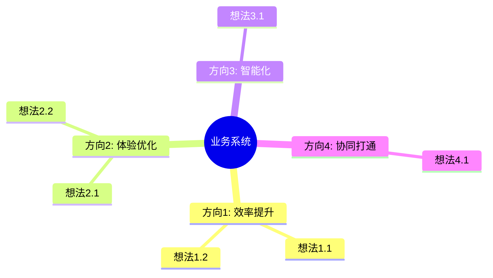
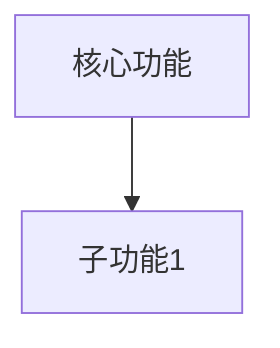
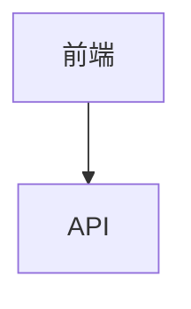

# SOP PRD - 产品需求文档生成

> 知识驱动 + 问题驱动 + 领域最佳实践

## 概述

本SOP提供PRD生成框架，核心特点：
1. **知识前置**：先收集领域知识，再生成PRD（依赖 sop-knowledge）
2. **问题驱动**：先理解问题，再生成方案
3. **最佳实践**：自动引用行业标准和技术规范
4. **可测试性**：用户故事遵循 INVEST 标准，验收标准使用 Given/When/Then 格式
5. **需求追溯**：自动生成需求-测试用例追溯矩阵，衔接 `/sop test-design`
6. **可视化原型**：PRD 生成后自动产出可编辑 HTML 原型（v5.0.0）

## 与其他 SOP 的关系

| 前置 SOP      | 用途                         |
| ------------- | ---------------------------- |
| sop-knowledge | 收集领域知识（**必须前置**） |
| sop-prd       | 生成 PRD + 可编辑 HTML 原型  |
| sop-scaffold  | 生成脚手架                   |

---

## Step 0: 依赖检查 (DEPENDENCY CHECK) [AUTO]

> **重要**：在生成PRD之前，检查是否有可用的前置产物

### 执行指令

```agent
# 1. 根据用户输入的业务领域，搜索已存在的知识文档
# 2. 使用Glob搜索约定路径
# 3. 找到则加载元数据，找不到则询问用户
```

### 搜索规范

| 产物类型 | 搜索路径          | 搜索模式                     |
| -------- | ----------------- | ---------------------------- |
| 领域知识 | `.sop/knowledge/` | `knowledge-{name}-*.md`      |
| 技术规范 | `.sop/knowledge/` | `knowledge-{name}-spec-*.md` |

### 执行逻辑

**步骤1：自动搜索**
```agent
# 根据用户输入的业务关键词，搜索相关知识文档
# 例如：用户输入"智能规则引擎"，搜索 knowledge-*-rule-*.md, knowledge-*rule-engine*.md
Glob(pattern=".sop/knowledge/knowledge-*{keyword}*.md")
```

**步骤2：处理搜索结果**

| 检查结果 | 执行动作                               |
| -------- | -------------------------------------- |
| 找到多个 | 选择最新版本（按日期排序），加载元数据 |
| 找到1个  | 加载该文件的元数据                     |
| 没找到   | 进入步骤3请求用户协助                  |

**步骤3：自动处理**（找不到时）

> v5.1.0 优化：不再阻塞询问，自动执行以下逻辑：
> - 记录 `knowledge_id: null`
> - 状态标记为 `skipped`
> - 直接继续 Step 1，不阻塞

```markdown
## 依赖检查结果
- 状态: skipped (未找到知识文档)
- 处理方式: auto_skip
- 后续: 使用通用模板生成 PRD
```

> **优化说明**：如需使用领域知识，可在 PRD 生成后手动运行 `/sop knowledge` 收集，再重新生成。

**如果用户提供路径**：
```agent
# 读取用户提供的文件
Read(file_path="{user_provided_path}")
# 验证文件格式，提取元数据
```

### 按需检查机制

> 除了启动时检查，步骤内部也可按需触发依赖检查

**触发条件**：
- 需要引用领域知识时（如撰写技术方案章节）
- 需要引用技术规范时（如定义数据模型）

**按需检查指令**：
```agent
# 在任何步骤中，如果需要引用前置产物，可调用此检查
# 例如：在Step 6生成PRD时，需要再次确认知识文档

Glob(pattern=".sop/knowledge/knowledge-*{keyword}*.md")
# 如果之前已加载，检查状态文档中的记录
Read(file_path=".sop/output/status-prd-{name}.md")  # 如有
```

**AskUserQuestion 按需触发**：
```javascript
// 当按需检查发现产物丢失时
AskUserQuestion({
  question: "之前加载的知识文档似乎不存在了，请提供路径或重新运行sop-knowledge",
  header: "依赖丢失",
  options: [
    { label: "提供路径", description: "手动输入文件路径" },
    { label: "重新收集", description: "运行 /sop knowledge" }
  ],
  multiSelect: false
})
```

### 输出状态文档

```markdown
---
sop: prd
step: 0_dependency
status: completed | skipped
---

## 依赖检查结果

### 知识文档
- 状态: found | not_found | skipped
- 文件: {file_path}
- 元数据:
  - knowledge_id: {id}
  - domain: {领域}
  - created_at: {日期}

### 技术规范（如有）
- 文件: {spec_file_path}

### 处理方式: auto_discover | user_provided | skipped
```

### 状态持久化（Checkpoint）

> 每个步骤完成后，自动保存状态到 `.sop/state/prd-{id}.json`

```json
{
  "sop": "prd",
  "task_id": "prd-20260421-001",
  "status": "in_progress",
  "started_at": "2026-04-21T10:00:00Z",
  "current_step": 0,
  "steps": {
    "0_dependency": { "status": "completed", "timestamp": "..." },
    "1_initiate": { "status": "pending" },
    "1.2_brainstorm": { "status": "pending" },
    "1.5_doc_type": { "status": "pending" },
    "2_requirements": { "status": "pending" },
    "3_decisions": { "status": "pending" },
    "4_generate": { "status": "pending" },
    "5_prototype": { "status": "pending" },
    "6_output": { "status": "pending" }
  },
  "data": {
    "knowledge_id": null,
    "product_name": null,
    "domain": null
  },
  "resume_from": ".sop/state/prd-{id}.json"
}
```

**断点续传**：下次执行时自动检测状态文件，如存在则从断点继续：
```bash
# 自动检测并恢复
if [ -f .sop/state/prd-{id}.json ]; then
  # 从current_step继续执行
fi
```

---

## Step 1: 关键确认 (KEY CONFIRM) [CONFIRM_REQUIRED]

> v5.1.0 优化：合并多次确认为单次确认

### 执行指令

一次性收集所有关键信息：

```agent
# 1. 解析用户输入，识别业务类型
# 2. 生成 HMW 问题候选
# 3. 一次性展示确认
```

### 业务类型识别

| 关键词              | 业务类型 | 行业背景     |
| ------------------- | -------- | ------------ |
| 电商、商城、订单    | 电商平台 | 零售电商     |
| 管理、后台、OA、CRM | 管理系统 | 企业服务     |
| 物流、配送、运输    | 物流配送 | 物流行业     |
| 小程序              | 小程序   | 移动互联网   |
| 金融、支付、贷款    | 金融科技 | 金融科技     |
| {自定义关键词}      | {业务类型} | {行业背景} |

### 一次性确认 AskUserQuestion

> 将 Step 1 + Step 1.2 + Step 1.5 合并为单次确认

```javascript
AskUserQuestion({
  question: "请确认以下信息，或选择你关心的方向：",
  header: "PRD 关键信息确认",
  options: [
    { label: "效率提升", description: "如何让系统提升30%效率？" },
    { label: "用户体验", description: "如何让用户使用更便捷？" },
    { label: "智能自动化", description: "如何用AI替代人工决策？" },
    { label: "扩展性", description: "如何支持10倍业务增长？" },
    { label: "数据可视化", description: "如何让数据驱动决策？" }
  ],
  multiSelect: false
})
```

**补充问询**（如果用户输入过于简单）：
> **请补充以下信息：**
> 1. 核心用户是谁？（如：{角色1}、{角色2}）
> 2. 主要解决什么问题？（如：{问题1}、{问题2}）
> 3. 为什么现在需要做？（如：{原因1}、{原因2}）

---

## Step 1.2: 脑暴探索 (BRAINSTORM) [CONFIRM_REQUIRED]

> **目的**：在结构化需求深挖之前，先帮用户发散思维、厘清方向，避免过早收敛到狭窄方案。
> **位置**：Step 1 识别业务类型之后，Step 1.5 选择文档类型之前。
> **输入**：Step 1 的业务类型识别结果 + 用户初始描述。

### Phase A: 发散 (Diverge)

**目标**：用结构化问题打开思路，发现用户自己可能没想到的角度。

#### A1. How Might We 问题

基于 Step 1 识别的业务类型，自动生成 3-5 个 HMW 问题：

```agent
# 根据业务类型生成 HMW 问题
# 例如：业务类型 = "物流管理系统"
# → "我们如何让配送员减少50%的无效等待？"
# → "我们如何让用户实时感知包裹位置而不焦虑？"
# → "我们如何让调度从人工经验变成智能决策？"
# → "我们如何让异常处理从被动响应变成主动预防？"
```

**HMW 生成规则**：

| 维度 | 问题方向 | 示例 |
|------|----------|------|
| 效率 | 如何减少浪费/等待/重复 | "如何让XX操作从3步变成1步？" |
| 体验 | 如何降低认知负荷/焦虑 | "如何让用户不用看说明书就会用？" |
| 智能 | 如何用数据/AI替代人工判断 | "如何让系统自动做XX决策？" |
| 扩展 | 如何支持未来增长/新场景 | "如何让系统支持10倍业务量？" |
| 协同 | 如何打通信息孤岛/流程断点 | "如何让XX和XX实时同步？" |

**执行方式**：

```javascript
AskUserQuestion({
  question: "以下是基于你的业务场景生成的 HMW 问题，选择你最关心的 2-3 个，或补充你自己的：",
  header: "HMW 发散",
  options: [
    { label: "{HMW问题1}", description: "{问题描述}" },
    { label: "{HMW问题2}", description: "{问题描述}" },
    { label: "{HMW问题3}", description: "{问题描述}" },
    { label: "{HMW问题4}", description: "{问题描述}" }
  ],
  multiSelect: true
})
```

#### A2. 约束破除

挑战用户的隐含假设，打开可能性空间：

```agent
# 识别用户描述中的隐含约束并逐一挑战
# 例如：
# 用户说 "做一个订单管理系统"
# → 隐含约束：需要人工下单 → 破除：能否自动预测补货？
# → 隐含约束：订单是单向的 → 破除：能否支持双向协商？
# → 隐含约束：需要登录才能用 → 破除：能否免登录快速下单？
```

**约束破除清单**：

| 隐含假设 | 破除问题 | 可能的新方向 |
|----------|----------|--------------|
| {假设1} | 如果这个限制不存在呢？ | {方向1} |
| {假设2} | 如果反过来做呢？ | {方向2} |
| {假设3} | 如果目标用户完全不同呢？ | {方向3} |

#### A3. 自由补充

```javascript
AskUserQuestion({
  question: "除了以上，你还有什么想法、灵感、或参考产品想分享？",
  header: "自由补充",
  options: [
    { label: "我有补充", description: "输入你的想法、参考产品、灵感来源" },
    { label: "跳过", description: "没有额外补充，继续" }
  ],
  multiSelect: false
})
```

### Phase B: 可视化 (Visualize)

**目标**：将散乱的想法结构化，让用户看到全貌。

#### B1. 自动生成思维导图

基于 Phase A 的产出，生成 Mermaid 思维导图：

```agent
# 将 HMW 选择 + 约束破除 + 自由补充整合为思维导图
# 中心节点：业务系统名称
# 一级分支：核心方向（从 HMW 选择中提炼）
# 二级分支：具体想法（从约束破除和自由补充中提取）
```

**思维导图模板**：



#### B2. 用户确认/编辑

```javascript
AskUserQuestion({
  question: "以上是整理后的思维导图，是否需要调整？",
  header: "思维导图",
  options: [
    { label: "确认，继续", description: "思维导图准确反映了我的想法" },
    { label: "需要补充", description: "我有额外的方向或想法要加" },
    { label: "需要修改", description: "某些分支不准确，需要调整" }
  ],
  multiSelect: false
})
```

### Phase C: 聚焦 (Converge)

**目标**：从发散的想法中筛选出最值得做的方向。

#### C1. 影响力/难度矩阵

将 Phase B 确认的想法放入 2x2 矩阵：

```agent
# 对每个想法评估：
# - 影响力（High/Low）：对核心问题的解决程度
# - 难度（High/Low）：技术实现复杂度 + 所需资源
```

**矩阵输出**：

```markdown
| 象限 | 策略 | 想法 |
|------|------|------|
| 🟢 高影响/低难度 | **立即做**（Quick Wins） | {想法列表} |
| 🔵 高影响/高难度 | **规划做**（Strategic Bets） | {想法列表} |
| 🟡 低影响/低难度 | **可选做**（Fill-ins） | {想法列表} |
| 🔴 低影响/高难度 | **暂不做**（Deprioritize） | {想法列表} |
```

#### C2. MVP 方向确认

```javascript
AskUserQuestion({
  question: "基于影响力/难度分析，你希望 MVP 聚焦在哪些方向？",
  header: "MVP 聚焦",
  options: [
    { label: "Quick Wins 优先", description: "先做高影响低难度的，快速验证" },
    { label: "Strategic Bet", description: "聚焦一个高影响方向，做深做透" },
    { label: "混合策略", description: "Quick Wins + 1个 Strategic Bet" },
    { label: "自定义选择", description: "我来手动选择要包含的方向" }
  ],
  multiSelect: false
})
```

### 输出：脑暴文档

```agent
Write(
  file_path=".sop/output/brainstorm-{kebab-case-name}-{date}.md",
  content="{{brainstorm_content}}"
)
```

**脑暴文档结构**：

```markdown
---
sop: prd
step: 1.2_brainstorm
status: completed
---

# 脑暴探索：{业务系统名称}

## 1. HMW 问题（已选）

| # | HMW 问题 | 关联维度 |
|---|----------|----------|
| 1 | {问题} | {效率/体验/智能/扩展/协同} |

## 2. 约束破除

| 隐含假设 | 破除方向 | 新想法 |
|----------|----------|--------|
| {假设} | {破除} | {想法} |

## 3. 自由补充

{用户补充的内容}

## 4. 思维导图


## 5. 影响力/难度矩阵

| 象限 | 想法 |
|------|------|
| 🟢 Quick Wins | ... |
| 🔵 Strategic Bets | ... |
| 🟡 Fill-ins | ... |
| 🔴 Deprioritize | ... |

## 6. MVP 方向共识

**选择的策略**: {Quick Wins 优先 / Strategic Bet / 混合策略}
**包含的方向**:
- {方向1}
- {方向2}

## 7. 下一步输入

> 以上共识将作为 Step 2 需求深挖的输入，确保深挖聚焦在用户真正关心的方向上。
```

### 状态持久化

```bash
npx ts-node --transpile-only .claude/scripts/sop-state-save.ts prd 1.2_brainstorm completed
```

### 与后续步骤的衔接

| 脑暴产出 | → 后续步骤 |
|----------|-----------|
| HMW 选择 | → Step 2 Phase A 问题发现（聚焦深挖） |
| MVP 方向共识 | → Step 2 Phase C 深度需求（避免发散） |
| 约束破除 | → Step 3 范围决策（参考"暂不做"象限） |
| 思维导图 | → Step 4 PRD 生成（产品定位参考） |

---

## Step 1.5: 文档类型选择 (DOC_TYPE) [CONFIRM_REQUIRED]

### 执行指令

根据项目规模和用途，选择 PRD 文档层级：

### AskUserQuestion

```javascript
AskUserQuestion({
  question: "请选择 PRD 文档类型：",
  header: "文档类型",
  options: [
    { label: "标准版(推荐)", description: "BRD + PRD 完整版，适合商业项目和对外汇报，含 6-7 个配套附件" },
    { label: "精简版", description: "PRD 核心内容，适合快速迭代和内部项目，含 3-4 个配套附件" },
    { label: "完整版", description: "BRD + MRD + PRD，适合大型项目立项汇报，含 9+ 个配套附件" }
  ],
  multiSelect: false
})
```

### 文档层级映射

| 层级 | 核心文档 | 配套附件 | 深度 |
|------|----------|----------|------|
| 精简版 | 05_PRD_LITE | 06_FLOW + 08_DATA_DICT + 10_NFR | 基础问题 + MVP 功能 |
| 标准版 | 01_BRD + 04_PRD_FULL | 06_FLOW + 07_SEQUENCE + 08_DATA_DICT + 09_PERMISSION + 10_NFR | 完整问题发现 + 市场研究 + 深度需求 |
| 完整版 | 01_BRD + 02_MRD + 04_PRD_FULL | 06~13 全部 | 全部三阶段深挖 |

### 状态持久化

```bash
npx ts-node --transpile-only .claude/scripts/sop-state-save.ts prd 1.5_doc_type completed tier=standard
```

---

## Step 1.75: AI 辅助用户故事生成 (AI_USER_STORY) [AUTO]

> 在进入深度需求分析前，使用 AI 辅助生成用户故事初稿，提升需求捕获效率

### 执行指令

基于 Step 1 + Step 1.2 的产出，使用 AI 生成候选用户故事：

```agent
# 1. 读取前期产出
load_state .sop/state/prd-{id}.json

# 2. AI 辅助生成用户故事
Write(
  file_path=".sop/output/user-stories-draft.md",
  content="# 用户故事候选（AI 辅助生成）

## 输入信息
- HMW 选择：{{hmw_selection}}
- MVP 方向：{{mvp_direction}}
- 目标用户：{{target_users}}

## 候选用户故事

### US-01
**As a** {{用户}},
**I want to** {{功能}},
**So that** {{价值}}

| 验收标准 | Given | When | Then |
|----------|-------|------|------|
| 正常 | | | |
| 异常 | | | |

### US-02
...

## AI 建议

- **优先级建议**：基于影响力和实现难度排序
- **风险提示**：{{potential_risks}}
- **遗漏检查**：{{possible_gaps}}
"
)

# 3. 保存状态
npx ts-node --transpile-only .claude/scripts/sop-state-save.ts prd 1.75_ai_story completed
```

> **自动模式**：Step 1.75 会自动完成用户故事初稿生成和状态保存

### 提示词模板

如果需要手动触发 AI，可以使用以下提示词：

```
基于以下信息生成 3-5 个用户故事候选：

**问题**：{{core_problem}}
**解决方案**：{{solution}}
**目标用户**：{{target_users}}
**MVP 方向**：{{mvp_direction}}

请按以下格式输出：
- 每个故事包含：As a... I want to... So that...
- 每个故事附带 2-3 个验收标准（Given/When/Then 格式）
- 每个故事附带 INVEST 自检评分（Independent, Negotiable, Valuable, Estimable, Small, Testable）
```

### 与后续步骤的衔接

| 产出 | → 后续步骤 |
|------|-----------|
| 用户故事候选 | → Step 2 Phase A/B 深度验证 |
| 验收标准初稿 | → Step 3 DoR 检查 |
| AI 风险提示 | → Step 3 范围决策参考 |

### 状态持久化

```bash
npx ts-node --transpile-only .claude/scripts/sop-state-save.ts prd 1.75_ai_story completed
```

---

## Step 2: 需求深挖 (REQUIREMENTS) [AUTO]

> 合并原问题发现、市场研究、深度需求三阶段，减少步骤冗余

### Phase A: 问题发现

```agent
# 基于 Step 0/1 的输入，深入挖掘问题
```

| #    | 问题                         | 目的                             |
| ---- | ---------------------------- | -------------------------------- |
| 1    | **谁**有这个问题？           | 明确用户角色和首要用户           |
| 2    | **什么**是他们面临的痛点？   | 描述可观察的问题，而非假设的方案 |
| 3    | **为什么**他们现在无法解决？ | 现有方案的不足                   |
| 4    | **为什么**现在要做？         | 业务驱动因素                     |
| 5    | **如何**判断做成了？         | 成功指标                         |

### Phase B: 市场锚定

```agent
# 1. 如果有知识文档，自动引用竞品分析和技术方案
# 2. 如果无知识文档，Web 搜索行业方案和竞品
# 3. 记录可借鉴的模式和需避免的反模式
```

**已有知识引用**（如已完成 sop-knowledge）：
- 竞品分析：直接从知识文档引入
- 技术方案参考：引用行业主流方案
- 最佳实践：引用领域标准

**无知识时的轻量调研**：
- 搜索同领域产品/功能
- 识别竞品核心能力和差异化
- 记录 3-5 个关键发现

### Phase C: 深度需求

| #    | 问题                                                         | 目的           |
| ---- | ------------------------------------------------------------ | -------------- |
| 1    | **愿景**：成功后的理想状态是什么？                           | 定义成功画面   |
| 2    | **JTBD**：When {situation}, I want {motivation}, so I can {outcome} | 理解用户动机   |
| 3    | **非用户**：谁明确不是目标？                                 | 边界清晰       |
| 4    | **约束**：有什么限制？                                       | 技术/时间/预算 |

### AskUserQuestion 示例

```javascript
AskUserQuestion({
  question: "请描述这个产品要解决的核心问题",
  header: "核心问题",
  options: [
    { label: "效率提升", description: "现有流程效率低，需要自动化" },
    { label: "风险控制", description: "需要识别和防范某种风险" },
    { label: "用户体验", description: "需要改善用户使用体验" },
    { label: "新增能力", description: "需要支持以前不支持的功能" },
    { label: "默认继续(推荐)", description: "使用通用模板自动执行" }
  ],
  multiSelect: false
})
```

### 状态持久化

```bash
npx ts-node --transpile-only .claude/scripts/sop-state-save.ts prd 2_requirements completed
```

---

## Step 3: 范围和决策 (DECISIONS) [CONFIRM_REQUIRED]

### 执行指令

明确 MVP 边界和优先级：

### 必问问题

| #    | 问题                                     | 目的         |
| ---- | ---------------------------------------- | ------------ |
| 1    | **MVP 定义**：最小可验证什么？           | 明确首版范围 |
| 2    | **Must/Should/Could**：优先级排序        | 资源分配     |
| 3    | **关键假设**：We believe {X} will {Y}... | 可测试假设   |
| 4    | **不做**：明确不包含什么                 | 管理预期     |
| 5    | **开放问题**：什么不确定？               | 风险识别     |

### DoR/DoD 检查清单

#### DoR (Definition of Ready) — 需求就绪标准

> 每个用户故事进入开发前必须满足：

| 检查项 | 状态 |
|--------|------|
| 验收标准使用 Given/When/Then 格式 | ⬜ |
| 用户故事满足 INVEST 标准 | ⬜ |
| 无阻塞依赖（或依赖已解决） | ⬜ |
| UI/UX 设计稿已提供（如有界面变更） | ⬜ |
| 技术方案已确认（如有架构变更） | ⬜ |
| 数据模型已定义（如有新实体） | ⬜ |

#### DoD (Definition of Done) — 完成标准

> 每个用户故事交付前必须满足：

| 检查项 | 状态 |
|--------|------|
| 代码已提交并通过 Code Review | ⬜ |
| 单元测试覆盖率 ≥ 80% | ⬜ |
| 集成测试通过 | ⬜ |
| API 文档已更新 | ⬜ |
| 无 CRITICAL/HIGH 级别 Bug | ⬜ |
| 验收标准全部通过 | ⬜ |
| 部署到测试环境验证 | ⬜ |

### 状态持久化

```bash
npx ts-node --transpile-only .claude/scripts/sop-state-save.ts prd 3_decisions completed
```

---

## Step 4: 生成 PRD 文档 (GENERATE) [AUTO]

### 执行指令

```agent
# 1. 检查断点状态
if [ -f .sop/state/prd-{id}.json ]; then
  load_state .sop/state/prd-{id}.json
fi

# 2. 生成PRD文档
Write(
  file_path=".sop/output/prd-{kebab-case-name}-{date}.md",
  content="{{prd_content_with_knowledge}}"
)

# 3. 保存状态（自动执行，无需等待）
npx ts-node --transpile-only .claude/scripts/sop-state-save.ts prd 4_generate completed
```

> **自动模式**：Step 4 会自动完成文档生成和状态保存，无需用户确认

### PRD 模板（知识增强版）

**重要**：严格按照以下章节编号生成，确保结构完整

```markdown
---

## 0. 执行摘要

### 问题陈述
{Who has what problem, and what's the cost of not solving it?}

### Proposed Solution
{What we're building and why this approach over alternatives}

### 关键假设 (Hypothesis)
We believe {capability} will {solve problem} for {users}.
We'll know we're right when {measurable outcome}.

### 成功指标
| 指标 | 目标 | 衡量方式 |
|------|------|----------|
| {Primary} | {Target} | {Method} |

---

## 1. 业务背景

### 1.1 行业背景
{行业背景描述}
*(引用自知识库：行业概览)*

### 1.2 行业挑战
- 挑战1：{描述}
*(引用自知识库：行业挑战)*

### 1.3 产品目标
- 目标1：{可量化}
- 目标2：{可量化}

### 1.4 成功指标
| 指标 | 目标值 | 衡量方式 | 行业基准 |
|------|--------|----------|----------|
| | | | {来自知识库} |

---

## 2. 产品概述

### 2.1 产品定位
{产品为谁做什么}

### 2.2 目标用户
| 用户角色 | 描述 | 使用场景 |
|----------|------|----------|
| 角色A | 描述 | 场景 |

### 2.3 产品范围
- **包含**：功能A、功能B
- **不包含**：功能X、功能Y

### 2.4 竞品分析
*(引用自知识库：竞品分析)*
| 竞品 | 优势 | 劣势 | 差异化 |
|------|------|------|--------|
| | | | |

---

## 3. 市场研究

### 3.1 竞品分析
*(引用自知识库：竞品分析)*
| 竞品/方案 | 核心能力 | 优劣势 | 可借鉴点 |
|----------|---------|--------|----------|
| | | | |

### 3.2 行业最佳实践
- 实践1：{描述}
*(引用自知识库)*

### 3.3 技术方案参考
| 方案 | 技术特点 | 适用性 |
|------|----------|--------|
| | | |

---

## 4. 产品设计

### 4.1 界面架构
{主要页面及其关系}

### 4.2 核心页面设计
| 页面 | 功能 | 关键组件 |
|------|------|----------|
| | | |

### 4.3 交互流程
{关键用户交互流程描述}

### 4.4 设计规范
*(引用自知识库：设计系统)*
| 规范项 | 要求 |
|--------|------|
| | |

---

## 5. 用户故事

### 5.1 用户角色
| 角色 | 描述 | 权限范围 |
|------|------|----------|
| | | |

### 5.2 用户故事矩阵 (MoSCoW + INVEST)

> 每个用户故事必须满足 **INVEST** 标准：
> - **I**ndependent（独立）：不依赖其他故事
> - **N**egotiable（可协商）：描述需求，非实现细节
> - **V**aluable（有价值）：对用户有明确价值
> - **E**stimable（可估算）：团队能估算工作量
> - **S**mall（小）：能在 1-2 个迭代内完成
> - **T**estable（可测试）：有明确的验收标准
>
> 不满足 **Small** 时，用 **SPIDR** 方法拆分：
> - **S**pike：先做技术探针
> - **P**ath：按工作流路径拆分
> - **I**nterface：按接口/集成点拆分
> - **D**ata：按数据类型/来源拆分
> - **R**ules：按业务规则拆分

| ID | 角色 | 故事 | 验收标准 | 优先级 | INVEST |
|----|------|------|----------|--------|--------|
| US-001 | | Given/When/Then | | Must | ✅/⚠️ |

#### 验收标准格式 (Given/When/Then)

每个用户故事的验收标准必须使用 Given/When/Then 格式：

```
Given {前置条件}
When {用户操作}
Then {预期结果}
```

**示例**：

| 故事 | 验收标准 |
|------|----------|
| US-001: 用户注册 | AC-1: Given 用户未注册, When 填写有效邮箱和密码并提交, Then 账号创建成功并收到验证邮件 |
| | AC-2: Given 用户未注册, When 填写已注册邮箱并提交, Then 提示"邮箱已被注册" |
| | AC-3: Given 用户未注册, When 填写弱密码(<8字符)并提交, Then 提示密码不符合要求 |

### 5.3 业务流程图
​```mermaid
graph LR
  A[开始] --> B[步骤1]
```

### 5.4 异常场景
| 场景  | 处理方式 |
| ----- | -------- |
| 异常1 | 处理描述 |

### 5.5 需求追溯矩阵

> 确保每个用户故事和验收标准都有对应的测试用例和技术任务。

| 用户故事 | 验收标准 | 测试用例 | 技术任务 | 状态 |
|----------|----------|----------|----------|------|
| US-001 | AC-001-1 | TC-001 | TASK-001 | ⬜ |
| US-001 | AC-001-2 | TC-002 | TASK-001 | ⬜ |
| US-002 | AC-002-1 | TC-003 | TASK-002 | ⬜ |

**追溯规则**：
1. 每个用户故事至少有一个测试用例
2. 每个验收标准至少被一个测试用例覆盖
3. 未覆盖项必须标记原因和补充计划
4. 覆盖率 < 100% 时需用户确认是否可接受

> **下一步**：运行 `/sop test-design` 自动生成测试用例并填充测试用例列

---

## 6. 功能规划

### 6.1 功能架构图


### 6.2 功能列表
| 模块 | 功能点 | 功能描述 | 优先级 | 权限要求 | 依赖 |
| ---- | ------ | -------- | ------ | -------- | ---- |
| {module} | {feature} | {description} | P{0-2} | {role} | {dependency} |

> **注意**：权限要求列需与5.1节用户角色定义保持一致

### 6.3 版本规划
| 版本 | 范围   | 交付时间 | 里程碑   |
| ---- | ------ | -------- | -------- |
| MVP  | P0功能 |          | 核心可用 |

---

## 7. 技术方案

### 7.1 系统架构图
*(引用自知识库：技术选型)*


### 7.2 技术栈
*(引用自知识库：技术选型建议)*
| 层级 | 技术 | 版本 |
| ---- | ---- | ---- |
|      |      |      |

### 7.3 数据模型
| 实体 | 字段 | 类型 | 说明 |
| ---- | ---- | ---- | ---- |
|      |      |      |      |

### 7.4 接口设计

> **统一异步任务响应范式**：所有异步任务接口采用统一响应格式：

```json
// 异步任务响应结构
{
  "task_id": "string",
  "status": "pending|running|completed|failed",
  "progress": 0-100,
  "result": { ... },       // 仅当 status=completed 时存在
  "error": {               // 仅当 status=failed 时存在
    "code": "ERROR_CODE",
    "message": "错误描述"
  },
  "created_at": "datetime",
  "completed_at": "datetime"  // 仅当 status=completed/failed 时存在
}
```

| 接口 | 方法 | 路径 | 说明 |
| ---- | ---- | ---- | ---- |
| {api_name} | {METHOD} | {/api/v1/resource} | {description} |

---

## 8. 非功能需求

### 8.1 性能要求
*(引用自知识库：性能基准)*
| 指标     | 要求   | 行业标准 |
| -------- | ------ | -------- |
| 响应时间 | <500ms | <100ms   |

### 8.2 可用性
| 指标   | 要求   |
| ------ | ------ |
| 可用性 | >99.9% |

### 8.3 安全
*(引用自知识库：合规要求)*
| 要求     | 说明 |
| -------- | ---- |
| 鉴权     | 需要 |
| 数据安全 | 加密 |

### 8.4 合规要求
*(引用自知识库：数据安全与隐私)*
| 法规 | 要求       | 当前状态 |
| ---- | ---------- | -------- |
| PIPL | 数据本地化 | 待实现   |

---

## 9. 风险评估

### 9.1 技术风险
| 风险 | 影响 | 应对措施 |
| ---- | ---- | -------- |
|      |      |          |

### 9.2 业务风险
| 风险 | 影响 | 应对措施 |
|------|------|----------|

### 9.3 依赖项
| 依赖方 | 内容 | 时间 |
| ------ | ---- | ---- |
|        |      |      |

---

## 10. 决策日志

| 决策 | 选择 | 替代方案 | 理由 |
| ---- | ---- | -------- | ---- |
|      |      |          |      |

---

## 11. 附录

### 11.1 术语表
*(引用自知识库)*
| 术语 | 说明 |
| ---- | ---- |
|      |      |

### 11.2 技术规范（按需）

> 根据项目需要，此处可放置接口协议、数据格式、业务规则等技术规范。
> 示例：JSON Schema、API 契约、枚举定义、状态机定义等。

### 11.3 参考文档
| 文档 | 链接 |
| ---- | ---- |
|      |      |

---

**文档状态**: DRAFT - 需要验证
**创建时间**: {date}
**基于知识**: {knowledge_id}
**下一步**: [生成 product-capability](./product-capability.md)
```

### 生成时的章节检查清单

> 生成 PRD 时必须检查以下章节是否存在且编号正确：

​```markdown
## 检查清单

- [ ] 0. 执行摘要
- [ ] 1. 业务背景 (1.1-1.4)
- [ ] 2. 产品概述 (2.1-2.4)
- [ ] 3. 市场研究 (3.1-3.3) ← 容易与产品概述混淆
- [ ] 4. 产品设计 (4.1-4.4) ← 容易缺失
- [ ] 5. 用户故事 (5.1-5.5)
- [ ] 6. 功能规划 (6.1-6.3)
- [ ] 7. 技术方案 (7.1-7.4)
- [ ] 8. 非功能需求 (8.1-8.4)
- [ ] 9. 风险评估 (9.1-9.3)
- [ ] 10. 决策日志
- [ ] 11. 附录 (11.1-11.2)
```

---

## Step 5: 原型生成 (PROTOTYPE) [AUTO]

### 执行指令

基于 Step 4 生成的 PRD，提取产品设计信息，生成可编辑 HTML 原型：

```agent
# 1. 读取 PRD 文档
Read(file_path=".sop/output/prd-{name}-{date}.md")

# 2. 提取关键信息
# - Section 4.1 信息架构 → 页面导航结构
# - Section 4.2 核心页面设计 → 每个页面的布局和组件
# - Section 4.3 交互流程 → 页面间的跳转关系
# - Section 5.1 用户角色 → 角色切换功能
# - Section 5.2 用户故事 → 表单字段和操作按钮

# 3. 生成 HTML 原型（参考 references/17_PROTOTYPE.md 模板）
Write(
  file_path=".sop/output/prototype-{kebab-case-name}-{date}.html",
  content="{{prototype_html}}"
)

# 4. 保存状态
npx ts-node --transpile-only .claude/scripts/sop-state-save.ts prd 5_prototype completed
```

### 原型生成规则

**从 PRD 提取内容的映射关系：**

| PRD 章节 | → 原型元素 |
|----------|-----------|
| 4.1 信息架构 | 顶部导航栏 / 侧边菜单 |
| 4.2 核心页面设计 | 每个页面一个 `<section data-page="...">` |
| 4.2 关键组件列 | 页面内的表单/表格/卡片等组件 |
| 4.3 交互流程 | 页面间的点击跳转 |
| 5.1 用户角色 | 角色切换下拉框 |
| 5.2 用户故事 | 操作按钮和表单字段 |

### 原型功能清单

生成的 HTML 原型包含：

| 功能 | 实现方式 |
|------|----------|
| 多页面导航 | `data-page` 属性 + JS 切换 |
| 文本可编辑 | `contenteditable="true"` |
| 表单交互 | 原生 `<input>` / `<select>` / `<checkbox>` |
| 视口切换 | 按钮切换 `max-width`（375/768/1280px） |
| 打印导出 | `@media print` + `window.print()` |
| 响应式布局 | Tailwind 响应式前缀（sm:/md:/lg:） |

### 输出路径

`.sop/output/prototype-{kebab-case-name}-{date}.html`

> 详细 HTML 模板参见 [references/17_PROTOTYPE.md](./references/17_PROTOTYPE.md)

---

## Step 6: 输出和后续 (OUTPUT) [AUTO]

### 执行指令

生成文档后，输出摘要：

```markdown
## PRD 已创建

**文件**:
- 脑暴: `.sop/output/brainstorm-{name}-{date}.md`
- PRD: `.sop/output/prd-{name}-{date}.md`
- 原型: `.sop/output/prototype-{name}-{date}.html`

### 摘要

**问题**: {一句话}
**方案**: {一句话}
**关键指标**: {Primary metric}

### 知识引用
- 领域知识：`.sop/knowledge/knowledge-{domain}-{date}.md`
- 技术规范：`.sop/knowledge/knowledge-{domain}-spec-{date}.md`

### 验证状态

| 章节 | 状态 |
|------|------|
| 问题陈述 | {Validated/Assumption} |
| 行业基准 | {引用自知识库} |
| 技术方案 | {引用自知识库} |
| 合规要求 | {引用自知识库} |

### 开放问题 ({count})
- {问题1}
- {问题2}

### 推荐下一步

1. **查看原型**: 在浏览器中打开 `.sop/output/prototype-{name}-{date}.html` 进行交互预览和编辑
2. **生成测试用例**: 运行 `/sop test-design` — 从用户故事自动生成测试用例和追溯矩阵
3. **如需技术实现约束**: 运行 `/product-capability`
4. **如需修改**: 编辑 `.sop/output/prd-{name}-{date}.md`
```

### 状态文档

```markdown
---
sop: prd
step: 6_output
status: completed
---

## PRD 生成完成

### 输出文件
- `.sop/output/brainstorm-{name}-{date}.md`
- `.sop/output/prd-{name}-{date}.md`
- `.sop/output/prototype-{name}-{date}.html`

### 知识引用
- [x] 行业知识已引用
- [x] 技术规范已引用
- [x] 合规要求已引用

### 文档章节
- [x] 0. 执行摘要
- [x] 1. 业务背景 (1.1-1.4)
- [x] 2. 产品概述 (2.1-2.4)
- [x] 3. 市场研究 (3.1-3.3) ← 独立章节
- [x] 4. 产品设计 (4.1-4.4) ← 新增
- [x] 5. 用户故事 (5.1-5.5)
- [x] 6. 功能规划 (6.1-6.3)
- [x] 7. 技术方案 (7.1-7.4)
- [x] 8. 非功能需求 (8.1-8.4)
- [x] 9. 风险评估 (9.1-9.3)
- [x] 10. 决策日志
- [x] 11. 附录 (11.1-11.2)

### 完成条件
- [x] 问题已明确
- [x] 知识已收集/引用
- [x] 用户已定义
- [x] 范围已界定
- [x] 指标已设定
- [x] PRD 文档已生成
- [x] HTML 原型已生成
```

---

## 输出目录

```
.sop/
├── knowledge/
│   ├── knowledge-game-risk-20260421.md      # 领域知识
│   └── knowledge-game-risk-spec-20260421.md # 技术规范
└── output/
    ├── brainstorm-game-risk-20260421.md     # 脑暴探索文档
    ├── prd-game-risk-20260421.md            # PRD文档
    └── prototype-game-risk-20260421.html    # 可编辑HTML原型
```

## 自动执行模式

> 支持完全自动化执行

### 断点续传

```bash
# 检查是否有未完成的任务
ls .sop/state/prd-*.json

# 从断点恢复（自动检测）
/sop prd {业务系统}
# → 自动检测到 .sop/state/prd-{id}.json
# → 从 step 2 继续执行
```

### 自动保存状态

每个步骤完成后自动保存状态到 `.sop/state/prd-{id}.json`：
```json
{
  "task_id": "prd-xxx",
  "current_step": 3,
  "status": "in_progress",
  "steps": {
    "0_dependency": {"status": "completed"},
    "1_initiate": {"status": "completed"},
    "1.2_brainstorm": {"status": "completed"},
    "1.5_doc_type": {"status": "completed"},
    "2_requirements": {"status": "completed"},
    "3_decisions": {"status": "in_progress"}
  }
}
```

### 减少阻塞

所有 AskUserQuestion 添加"默认继续"选项，选择后自动执行，无需等待确认。

## 触发命令

```
/sop prd
```

或描述：
- "生成PRD文档"
- "创建产品需求文档"
- "帮我生成一个XXX的PRD"

---

## 完整工作流程

```
用户: "我要做一个{业务系统}"

Step 0: /sop prd {业务系统}
   ↓
   检查是否有知识文档
   ↓
   ┌─ 有知识 → 加载知识，进入 Step 1
   ↓
   ┌─ 无知识 → AskUserQuestion:
   │           "是否需要先收集领域知识？"
   │            ↓
   │           用户选择"是"
   ↓
Step 0.5: /sop knowledge {业务领域}
   ↓
   输出：knowledge-{domain}-{date}.md
   ↓
Step 1: 智能识别 (INITIATE) [CONFIRM]
   ↓
Step 1.2: 脑暴探索 (BRAINSTORM) [CONFIRM]
   ↓ HMW发散 → 思维导图 → 影响力矩阵
Step 1.5: 文档类型选择 (DOC_TYPE) [CONFIRM]
   ↓ 精简/标准/完整
Step 2: 需求深挖 (REQUIREMENTS) [AUTO]
   ↓ Phase A 问题发现（聚焦脑暴方向）+ Phase B 市场锚定 + Phase C 深度需求
Step 3: 范围决策 (DECISIONS) [CONFIRM]
   ↓
Step 4: 生成 PRD (自动引用知识) [AUTO]
   ↓
   输出：prd-{domain}-{date}.md
   ↓
Step 5: 原型生成 (PROTOTYPE) [AUTO]
   ↓
   输出：prototype-{domain}-{date}.html
   ↓
Step 6: 输出和后续 (OUTPUT) [AUTO]
```

---

## 测试示例

### 示例 1：完整流程

**用户输入**：
```
/sop prd {业务系统}
```

**SOP 响应**：
1. Step 0: 检查知识文档 → 无
2. 询问：是否需要先收集知识？
3. 用户选择"是"
4. 自动触发 /sop knowledge {业务领域}
5. 收集知识完成
6. Step 1: 智能识别业务类型
7. Step 1.2: 脑暴探索（HMW 发散 → 思维导图 → 影响力矩阵）
8. Step 1.5: 选择文档类型（标准版）
9. Step 2: 需求深挖（聚焦脑暴方向）
10. Step 3: 范围决策
11. Step 4: 生成 PRD
12. Step 5: 生成可编辑 HTML 原型
13. Step 6: 输出摘要

### 示例 2：已有知识

**SOP 响应**：
1. Step 0: 检查知识文档 → 有（之前已收集）
2. 加载知识文档
3. Step 1-6: 完整流程（含原型生成）

### 示例 3：精简模式

**SOP 响应**：
1. Step 0: 检查知识文档 → 无
2. 用户选择"跳过知识"
3. Step 1: 智能识别
4. Step 1.5: 选择文档类型（精简版）
5. Step 2-6: 精简流程（含轻量原型）

---

## 参考

- [sop-knowledge](./sop-knowledge/SKILL.md) - 领域知识管理
- [prp-prd (ECC)](../everything-claude-code/commands/prp-prd.md) - 问题驱动 PRD 生成
- [product-capability (ECC)](../everything-claude-code/.agents/skills/product-capability/SKILL.md) - 能力计划生成