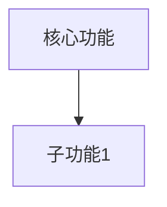
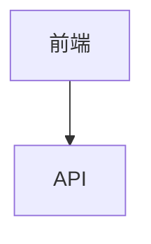

# SOP PRD - 产品需求文档生成

> 知识驱动 + 问题驱动 + 领域最佳实践

## 概述

本SOP提供PRD生成框架，核心特点：
1. **知识前置**：先收集领域知识，再生成PRD（依赖 sop-knowledge）
2. **问题驱动**：先理解问题，再生成方案
3. **最佳实践**：自动引用行业标准和技术规范

## 与其他 SOP 的关系

| 前置 SOP      | 用途                         |
| ------------- | ---------------------------- |
| sop-knowledge | 收集领域知识（**必须前置**） |
| sop-prd       | 生成 PRD                     |
| sop-scaffold  | 生成脚手架                   |

---

## Step 0: 依赖检查 (DEPENDENCY CHECK)

> **重要**：在生成PRD之前，检查是否有可用的前置产物

### 执行指令

```agent
# 1. 根据用户输入的业务领域，搜索已存在的知识文档
# 2. 使用Glob搜索约定路径
# 3. 找到则加载元数据，找不到则询问用户
```

### 搜索规范

| 产物类型 | 搜索路径          | 搜索模式                     |
| -------- | ----------------- | ---------------------------- |
| 领域知识 | `.sop/knowledge/` | `knowledge-{name}-*.md`      |
| 技术规范 | `.sop/knowledge/` | `knowledge-{name}-spec-*.md` |

### 执行逻辑

**步骤1：自动搜索**
```agent
# 根据用户输入的业务关键词，搜索相关知识文档
# 例如：用户输入"智能规则引擎"，搜索 knowledge-*-rule-*.md, knowledge-*rule-engine*.md
Glob(pattern=".sop/knowledge/knowledge-*{keyword}*.md")
```

**步骤2：处理搜索结果**

| 检查结果 | 执行动作                               |
| -------- | -------------------------------------- |
| 找到多个 | 选择最新版本（按日期排序），加载元数据 |
| 找到1个  | 加载该文件的元数据                     |
| 没找到   | 进入步骤3请求用户协助                  |

**步骤3：请求用户协助**（找不到时）

```javascript
AskUserQuestion({
  question: "未找到该领域的知识文档，请选择：",
  header: "依赖缺失",
  options: [
    { label: "运行sop-knowledge", description: "先运行 /sop knowledge 收集领域知识" },
    { label: "提供路径", description: "手动提供知识文档的绝对路径" },
    { label: "跳过", description: "不依赖领域知识，快速生成PRD" },
    { label: "默认继续(推荐)", description: "自动跳过，直接生成PRD" }
  ],
  multiSelect: false
})
```

> **注意**：选择"默认继续"将自动执行后续步骤，无需阻塞等待

**如果用户提供路径**：
```agent
# 读取用户提供的文件
Read(file_path="{user_provided_path}")
# 验证文件格式，提取元数据
```

### 按需检查机制

> 除了启动时检查，步骤内部也可按需触发依赖检查

**触发条件**：
- 需要引用领域知识时（如撰写技术方案章节）
- 需要引用技术规范时（如定义数据模型）

**按需检查指令**：
```agent
# 在任何步骤中，如果需要引用前置产物，可调用此检查
# 例如：在Step 6生成PRD时，需要再次确认知识文档

Glob(pattern=".sop/knowledge/knowledge-*{keyword}*.md")
# 如果之前已加载，检查状态文档中的记录
Read(file_path=".sop/output/status-prd-{name}.md")  # 如有
```

**AskUserQuestion 按需触发**：
```javascript
// 当按需检查发现产物丢失时
AskUserQuestion({
  question: "之前加载的知识文档似乎不存在了，请提供路径或重新运行sop-knowledge",
  header: "依赖丢失",
  options: [
    { label: "提供路径", description: "手动输入文件路径" },
    { label: "重新收集", description: "运行 /sop knowledge" }
  ],
  multiSelect: false
})
```

### 输出状态文档

```markdown
---
sop: prd
step: 0_dependency
status: completed | skipped
---

## 依赖检查结果

### 知识文档
- 状态: found | not_found | skipped
- 文件: {file_path}
- 元数据:
  - knowledge_id: {id}
  - domain: {领域}
  - created_at: {日期}

### 技术规范（如有）
- 文件: {spec_file_path}

### 处理方式: auto_discover | user_provided | skipped
```

### 状态持久化（Checkpoint）

> 每个步骤完成后，自动保存状态到 `.sop/state/prd-{id}.json`

```json
{
  "sop": "prd",
  "task_id": "prd-20260421-001",
  "status": "in_progress",
  "started_at": "2026-04-21T10:00:00Z",
  "current_step": 0,
  "steps": {
    "0_dependency": { "status": "completed", "timestamp": "..." },
    "1_initiate": { "status": "pending" },
    "2_foundations": { "status": "pending" },
    "3_grounding": { "status": "pending" },
    "4_deep_dive": { "status": "pending" },
    "5_decisions": { "status": "pending" },
    "6_generate": { "status": "pending" },
    "7_output": { "status": "pending" }
  },
  "data": {
    "knowledge_id": null,
    "product_name": null,
    "domain": null
  },
  "resume_from": ".sop/state/prd-{id}.json"
}
```

**断点续传**：下次执行时自动检测状态文件，如存在则从断点继续：
```bash
# 自动检测并恢复
if [ -f .sop/state/prd-{id}.json ]; then
  # 从current_step继续执行
fi
```

---

## Step 1: 智能识别 (INITIATE)

### 执行指令

分析用户输入，识别业务类型：

| 关键词              | 业务类型 | 行业背景     |
| ------------------- | -------- | ------------ |
| 游戏、风控、外挂    | 游戏风控 | 游戏安全行业 |
| 电商、商城、订单    | 电商平台 | 零售电商     |
| 管理、后台、OA、CRM | 管理系统 | 企业服务     |
| 小程序              | 小程序   | 移动互联网   |
| App、手机应用       | 移动App  | 移动互联网   |
| 金融、支付、贷款    | 金融风控 | 金融科技     |

### 执行逻辑

```agent
# 1. 解析用户输入
# 2. 识别业务类型
# 3. 如果输入简单，询问更多信息
# 4. 如果输入详细，直接进入 FOUNDATION 阶段
```

### AskUserQuestion 引导

如果用户输入过于简单（如"帮我生成一个游戏风控的PRD"），需要追问：

> **请补充以下信息：**
> 1. 核心用户是谁？（如：风控运营人员、客服）
> 2. 主要解决什么问题？（如：外挂检测、盗号处理）
> 3. 为什么现在需要做？（如：人工审核效率低、投诉增加）

---

## Step 2: 问题发现 (FOUNDATION)

### 执行指令

```agent
# 基于 Step 0/1 的输入，深入挖掘问题
```

### 必问问题

| #    | 问题                         | 目的                             |
| ---- | ---------------------------- | -------------------------------- |
| 1    | **谁**有这个问题？           | 明确用户角色                     |
| 2    | **什么**是他们面临的痛点？   | 描述可观察的问题，而非假设的方案 |
| 3    | **为什么**他们现在无法解决？ | 现有方案的不足                   |
| 4    | **为什么**现在要做？         | 业务驱动因素                     |
| 5    | **如何**判断做成了？         | 成功指标                         |

### AskUserQuestion 示例

```javascript
AskUserQuestion({
  question: "请描述这个产品要解决的核心问题",
  header: "核心问题",
  options: [
    { label: "效率提升", description: "现有流程效率低，需要自动化" },
    { label: "风险控制", description: "需要识别和防范某种风险" },
    { label: "用户体验", description: "需要改善用户使用体验" },
    { label: "新增能力", description: "需要支持以前不支持的功能" },
    { label: "默认继续(推荐)", description: "使用通用模板自动执行" }
  ],
  multiSelect: false
})
```

---

## Step 3: 市场和竞品研究 (GROUNDING)

### 执行指令

```agent
# 1. 市场调研：搜索竞品和行业方案
# 2. 代码库探索（如果存在）：识别可复用模式
# 3. 如果已有知识文档，自动引用
```

### 执行内容

**已有知识引用**（如已完成 sop-knowledge）：
```markdown
## 市场研究（来自知识库）

### 竞品分析
| 竞品 | 核心功能 | 技术特点 |
|------|----------|----------|
| (从知识文档自动引入) |

### 技术方案
- 主流架构：{引用}
- 技术选型：{引用}
```

**新增调研**：
- 搜索同领域产品/功能
- 识别竞品解决方案
- 记录常见模式和反模式

---

## Step 4: 深度需求 (DEEP DIVE)

### 执行指令

基于 foundation + grounding 结果，继续挖掘：

### 必问问题

| #    | 问题                                                         | 目的           |
| ---- | ------------------------------------------------------------ | -------------- |
| 1    | **愿景**：成功后的理想状态是什么？                           | 定义成功画面   |
| 2    | **首要用户**：最重要的用户是谁？                             | 确定核心用户   |
| 3    | **JTBD**：When {situation}, I want {motivation}, so I can {outcome} | 理解用户动机   |
| 4    | **非用户**：谁明确不是目标？                                 | 边界清晰       |
| 5    | **约束**：有什么限制？                                       | 技术/时间/预算 |

---

## Step 5: 范围和决策 (DECISIONS)

### 执行指令

明确 MVP 边界和优先级：

### 必问问题

| #    | 问题                                     | 目的         |
| ---- | ---------------------------------------- | ------------ |
| 1    | **MVP 定义**：最小可验证什么？           | 明确首版范围 |
| 2    | **Must/Should/Could**：优先级排序        | 资源分配     |
| 3    | **关键假设**：We believe {X} will {Y}... | 可测试假设   |
| 4    | **不做**：明确不包含什么                 | 管理预期     |
| 5    | **开放问题**：什么不确定？               | 风险识别     |

---

## Step 6: 生成 PRD 文档 (GENERATE)

### 执行指令

```agent
# 1. 检查断点状态
if [ -f .sop/state/prd-{id}.json ]; then
  load_state .sop/state/prd-{id}.json
fi

# 2. 生成PRD文档
Write(
  file_path=".sop/output/prd-{kebab-case-name}-{date}.md",
  content="{{prd_content_with_knowledge}}"
)

# 3. 保存状态（自动执行，无需等待）
save_state(
  file=".sop/state/prd-{id}.json",
  step="6_generate",
  status="completed",
  output=".sop/output/prd-{kebab-case-name}-{date}.md"
)
```

> **自动模式**：Step 6 会自动完成文档生成和状态保存，无需用户确认

### PRD 模板（知识增强版）

**重要**：严格按照以下章节编号生成，确保结构完整

```markdown
---

## 0. 执行摘要

### 问题陈述
{Who has what problem, and what's the cost of not solving it?}

### Proposed Solution
{What we're building and why this approach over alternatives}

### 关键假设 (Hypothesis)
We believe {capability} will {solve problem} for {users}.
We'll know we're right when {measurable outcome}.

### 成功指标
| 指标 | 目标 | 衡量方式 |
|------|------|----------|
| {Primary} | {Target} | {Method} |

---

## 1. 业务背景

### 1.1 行业背景
{行业背景描述}
*(引用自知识库：行业概览)*

### 1.2 行业挑战
- 挑战1：{描述}
*(引用自知识库：行业挑战)*

### 1.3 产品目标
- 目标1：{可量化}
- 目标2：{可量化}

### 1.4 成功指标
| 指标 | 目标值 | 衡量方式 | 行业基准 |
|------|--------|----------|----------|
| | | | {来自知识库} |

---

## 2. 产品概述

### 2.1 产品定位
{产品为谁做什么}

### 2.2 目标用户
| 用户角色 | 描述 | 使用场景 |
|----------|------|----------|
| 角色A | 描述 | 场景 |

### 2.3 产品范围
- **包含**：功能A、功能B
- **不包含**：功能X、功能Y

### 2.4 竞品分析
*(引用自知识库：竞品分析)*
| 竞品 | 优势 | 劣势 | 差异化 |
|------|------|------|--------|
| | | | |

---

## 3. 市场研究

### 3.1 竞品分析
*(引用自知识库：竞品分析)*
| 竞品/方案 | 核心能力 | 优劣势 | 可借鉴点 |
|----------|---------|--------|----------|
| | | | |

### 3.2 行业最佳实践
- 实践1：{描述}
*(引用自知识库)*

### 3.3 技术方案参考
| 方案 | 技术特点 | 适用性 |
|------|----------|--------|
| | | |

---

## 4. 产品设计

### 4.1 界面架构
{主要页面及其关系}

### 4.2 核心页面设计
| 页面 | 功能 | 关键组件 |
|------|------|----------|
| | | |

### 4.3 交互流程
{关键用户交互流程描述}

### 4.4 设计规范
*(引用自知识库：设计系统)*
| 规范项 | 要求 |
|--------|------|
| | |

---

## 5. 用户故事

### 5.1 用户角色
| 角色 | 描述 | 权限范围 |
|------|------|----------|
| | | |

### 5.2 用户故事矩阵 (MoSCoW)
| ID | 角色 | 故事 | 验收标准 | 优先级 |
|----|------|------|----------|--------|
| US-001 | | | | Must |

### 5.3 业务流程图
​```mermaid
graph LR
  A[开始] --> B[步骤1]
```

### 5.4 异常场景
| 场景  | 处理方式 |
| ----- | -------- |
| 异常1 | 处理描述 |

---

## 6. 功能规划

### 6.1 功能架构图


### 6.2 功能列表
| 模块     | 功能点       | 功能描述                                                   | 优先级 | 权限要求          | 依赖     |
| -------- | ------------ | ---------------------------------------------------------- | ------ | ----------------- | -------- |
| 规则管理 | 规则冲突检测 | 检测新规则与已有规则是否存在冲突，包括条件包含、互斥等场景 | P1     | 算法工程师/管理员 | 规则列表 |
|          |              |                                                            |        |                   |          |

> **注意**：权限要求列需与5.1节用户角色定义保持一致：
> - 管理员：全部权限
> - 算法工程师：规则挖掘、评估、管理
> - 产品经理：评估、管理，无删除权限
> - 运营人员：查看、监控，无创建权限

### 6.3 版本规划
| 版本 | 范围   | 交付时间 | 里程碑   |
| ---- | ------ | -------- | -------- |
| MVP  | P0功能 |          | 核心可用 |

---

## 7. 技术方案

### 7.1 系统架构图
*(引用自知识库：技术选型)*


### 7.2 技术栈
*(引用自知识库：技术选型建议)*
| 层级 | 技术 | 版本 |
| ---- | ---- | ---- |
|      |      |      |

### 7.3 数据模型
| 实体 | 字段 | 类型 | 说明 |
| ---- | ---- | ---- | ---- |
|      |      |      |      |

> **数据隔离要求**：评估数据集必须与训练数据隔离，严禁重叠。具体要求：
> - **时间切片**：训练集使用T-N至T-1数据，评估集使用T期数据
> - **独立采样**：若无法时间切片，需确保评估样本与训练样本无交集
> - **数据穿越风险**：在7.4接口设计中增加校验逻辑，拒绝与训练集重叠的评估请求

### 7.4 接口设计

> **统一异步任务响应范式**：所有异步任务接口（如规则挖掘）采用统一响应格式：

```json
// 异步任务响应结构
{
  "task_id": "string",
  "status": "pending|running|completed|failed",
  "progress": 0-100,
  "result": { ... },       // 仅当 status=completed 时存在
  "error": {               // 仅当 status=failed 时存在
    "code": "ERROR_CODE",
    "message": "错误描述"
  },
  "created_at": "datetime",
  "completed_at": "datetime"  // 仅当 status=completed/failed 时存在
}
```

| 接口         | 方法 | 路径                              | 说明                       |
| ------------ | ---- | --------------------------------- | -------------------------- |
| 规则冲突检测 | POST | /api/v1/rules/{id}/check-conflict | 检测规则与已有规则是否冲突 |
| 告警配置     | POST | /api/v1/monitoring/alert          | 配置告警规则               |

> **告警通知渠道**：明确支持的渠道及配置：
> | 渠道     | 配置字段                       | 说明              |
> | -------- | ------------------------------ | ----------------- |
> | 邮件     | smtp_host, smtp_port, from, to | 标准SMTP配置      |
> | 钉钉     | webhook_url, secret            | 机器人Webhook     |
> | 企业微信 | webhook_url, secret            | 企业微信机器人    |
> | 短信     | provider, app_key, templates   | 阿里云/腾讯云短信 |
> | Webhook  | url, method, headers           | 通用回调          |

---

## 8. 非功能需求

### 8.1 性能要求
*(引用自知识库：性能基准)*
| 指标     | 要求   | 行业标准 |
| -------- | ------ | -------- |
| 响应时间 | <500ms | <100ms   |

### 8.2 可用性
| 指标   | 要求   |
| ------ | ------ |
| 可用性 | >99.9% |

### 8.3 安全
*(引用自知识库：合规要求)*
| 要求     | 说明 |
| -------- | ---- |
| 鉴权     | 需要 |
| 数据安全 | 加密 |

### 8.4 合规要求
*(引用自知识库：数据安全与隐私)*
| 法规 | 要求       | 当前状态 |
| ---- | ---------- | -------- |
| PIPL | 数据本地化 | 待实现   |

---

## 9. 风险评估

### 9.1 技术风险
| 风险 | 影响 | 应对措施 |
| ---- | ---- | -------- |
|      |      |          |

### 9.2 业务风险
| 风险 | 影响 | 应对措施 |
|------|------|----------|

### 9.3 依赖项
| 依赖方 | 内容 | 时间 |
| ------ | ---- | ---- |
|        |      |      |

---

## 10. 决策日志

| 决策 | 选择 | 替代方案 | 理由 |
| ---- | ---- | -------- | ---- |
|      |      |          |      |

---

## 11. 附录

### 11.1 术语表
*(引用自知识库)*
| 术语 | 说明 |
| ---- | ---- |
|      |      |

### 11.2 规则条件JSON Schema

> 定义规则条件字段的标准格式，避免前后端联调歧义：

```json
// 规则条件 JSON Schema
{
  "$schema": "http://json-schema.org/draft-07/schema#",
  "type": "object",
  "required": ["type"],
  "properties": {
    "type": {
      "type": "string",
      "enum": ["single", "multi", "tree"],
      "description": "规则类型：单特征/多特征/树模型"
    },
    "field": {
      "type": "string",
      "description": "特征字段名（仅single类型需要）"
    },
    "operator": {
      "type": "string",
      "enum": [">", ">=", "<", "<=", "==", "!=", "in", "not_in", "like", "between"],
      "description": "操作符"
    },
    "value": {
      "type": ["number", "string", "array"],
      "description": "比较值"
    },
    "conditions": {
      "type": "array",
      "description": "多条件列表（仅multi类型需要）",
      "items": {
        "type": "object",
        "properties": {
          "field": {"type": "string"},
          "operator": {"type": "string"},
          "value": {}
        }
      }
    },
    "logic": {
      "type": "string",
      "enum": ["AND", "OR"],
      "description": "多条件逻辑关系"
    },
    "tree_id": {
      "type": "string",
      "description": "树模型ID（仅tree类型需要）"
    },
    "path": {
      "type": "array",
      "description": "树路径（仅tree类型需要）"
    }
  }
}

// 使用示例
// 单特征规则：age > 30
{
  "type": "single",
  "field": "age",
  "operator": ">",
  "value": 30
}

// 多特征规则：age > 30 AND amount < 1000
{
  "type": "multi",
  "conditions": [
    {"field": "age", "operator": ">", "value": 30},
    {"field": "amount", "operator": "<", "value": 1000}
  ],
  "logic": "AND"
}

// 树模型规则
{
  "type": "tree",
  "tree_id": "tree_001",
  "path": [">30", "<1000", true]
}
```

### 11.3 参考文档
| 文档 | 链接 |
| ---- | ---- |
|      |      |

---

**文档状态**: DRAFT - 需要验证
**创建时间**: {date}
**基于知识**: {knowledge_id}
**下一步**: [生成 product-capability](./product-capability.md)
```

### 生成时的章节检查清单

> 生成 PRD 时必须检查以下章节是否存在且编号正确：

​```markdown
## 检查清单

- [ ] 0. 执行摘要
- [ ] 1. 业务背景 (1.1-1.4)
- [ ] 2. 产品概述 (2.1-2.4)
- [ ] 3. 市场研究 (3.1-3.3) ← 容易与产品概述混淆
- [ ] 4. 产品设计 (4.1-4.4) ← 容易缺失
- [ ] 5. 用户故事 (5.1-5.4)
- [ ] 6. 功能规划 (6.1-6.3)
- [ ] 7. 技术方案 (7.1-7.4)
- [ ] 8. 非功能需求 (8.1-8.4)
- [ ] 9. 风险评估 (9.1-9.3)
- [ ] 10. 决策日志
- [ ] 11. 附录 (11.1-11.2)
```

---

## Step 7: 输出和后续 (OUTPUT)

### 执行指令

生成文档后，输出摘要：

```markdown
## PRD 已创建

**文件**: `.sop/output/prd-{name}-{date}.md`

### 摘要

**问题**: {一句话}
**方案**: {一句话}
**关键指标**: {Primary metric}

### 知识引用
- 领域知识：`.sop/knowledge/knowledge-{domain}-{date}.md`
- 技术规范：`.sop/knowledge/knowledge-{domain}-spec-{date}.md`

### 验证状态

| 章节 | 状态 |
|------|------|
| 问题陈述 | {Validated/Assumption} |
| 行业基准 | {引用自知识库} |
| 技术方案 | {引用自知识库} |
| 合规要求 | {引用自知识库} |

### 开放问题 ({count})
- {问题1}
- {问题2}

### 推荐下一步

1. **如需技术实现约束**: 运行 `/product-capability`
2. **如需修改**: 编辑 `.sop/output/prd-{name}-{date}.md`
```

### 状态文档

```markdown
---
sop: prd
step: 7_output
status: completed
---

## PRD 生成完成

### 输出文件
- `.sop/output/prd-{name}-{date}.md`

### 知识引用
- [x] 行业知识已引用
- [x] 技术规范已引用
- [x] 合规要求已引用

### 文档章节
- [x] 0. 执行摘要
- [x] 1. 业务背景 (1.1-1.4)
- [x] 2. 产品概述 (2.1-2.4)
- [x] 3. 市场研究 (3.1-3.3) ← 独立章节
- [x] 4. 产品设计 (4.1-4.4) ← 新增
- [x] 5. 用户故事 (5.1-5.4)
- [x] 6. 功能规划 (6.1-6.3)
- [x] 7. 技术方案 (7.1-7.4)
- [x] 8. 非功能需求 (8.1-8.4)
- [x] 9. 风险评估 (9.1-9.3)
- [x] 10. 决策日志
- [x] 11. 附录 (11.1-11.2)

### 完成条件
- [x] 问题已明确
- [x] 知识已收集/引用
- [x] 用户已定义
- [x] 范围已界定
- [x] 指标已设定
- [x] PRD 文档已生成
```

---

## 输出目录

```
.sop/
├── knowledge/
│   ├── knowledge-game-risk-20260421.md      # 领域知识
│   └── knowledge-game-risk-spec-20260421.md # 技术规范
└── output/
    └── prd-game-risk-20260421.md            # PRD文档
```

## 自动执行模式

> v4.0.0 新增：支持完全自动化执行

### 断点续传

```bash
# 检查是否有未完成的任务
ls .sop/state/prd-*.json

# 从断点恢复（自动检测）
/sop prd 游戏风控
# → 自动检测到 .sop/state/prd-20260421-001.json
# → 从 step 2 继续执行
```

### 自动保存状态

每个步骤完成后自动保存状态到 `.sop/state/prd-{id}.json`：
```json
{
  "task_id": "prd-xxx",
  "current_step": 2,
  "status": "in_progress",
  "steps": {
    "0_dependency": {"status": "completed"},
    "1_initiate": {"status": "completed"},
    "2_foundations": {"status": "in_progress"}
  }
}
```

### 减少阻塞

所有 AskUserQuestion 添加"默认继续"选项，选择后自动执行，无需等待确认。

## 触发命令

```
/sop prd
```

或描述：
- "生成PRD文档"
- "创建产品需求文档"
- "帮我生成一个XXX的PRD"

---

## 完整工作流程

```
用户: "我要做一个游戏风控系统"

Step 0: /sop prd 游戏风控系统
   ↓
   检查是否有知识文档
   ↓
   ┌─ 有知识 → 加载知识，直接进入 Step 2
   ↓
   ┌─ 无知识 → AskUserQuestion:
   │           "是否需要先收集领域知识？"
   │            ↓
   │           用户选择"是"
   ↓
Step 0.5: /sop knowledge 游戏风控
   ↓
   输出：knowledge-game-risk-20260421.md
   ↓
Step 2: 问题发现 (FOUNDATION)
   ↓
Step 3: 市场研究 (引用知识库)
   ↓
Step 4: 深度需求 (DEEP DIVE)
   ↓
Step 5: 范围决策 (DECISIONS)
   ↓
Step 6: 生成 PRD (自动引用知识)
   ↓
   输出：prd-game-risk-20260421.md
   (自动包含：行业趋势、技术方案、合规要求)
```

---

## 测试示例

### 示例 1：完整流程

**用户输入**：
```
/sop prd 游戏风控系统
```

**SOP 响应**：
1. Step 0: 检查知识文档 → 无
2. 询问：是否需要先收集知识？
3. 用户选择"是"
4. 自动触发 /sop knowledge 游戏风控
5. 收集知识完成
6. 继续 Step 2-6，生成 PRD

### 示例 2：已有知识

**用户输入**：
```
/sop prd 游戏风控系统
```

**SOP 响应**：
1. Step 0: 检查知识文档 → 有（之前已收集）
2. 加载知识文档
3. 直接进入 Step 2-6，生成 PRD

### 示例 3：跳过知识

**用户输入**：
```
/sop prd 游戏风控系统
```

**SOP 响应**：
1. Step 0: 检查知识文档 → 无
2. 询问：是否需要先收集知识？
3. 用户选择"简化模式"
4. 直接进入 Step 2-6，生成简化版 PRD

---

## 参考

- [sop-knowledge](./sop-knowledge/SKILL.md) - 领域知识管理
- [prp-prd (ECC)](../everything-claude-code/commands/prp-prd.md) - 问题驱动 PRD 生成
- [product-capability (ECC)](../everything-claude-code/.agents/skills/product-capability/SKILL.md) - 能力计划生成