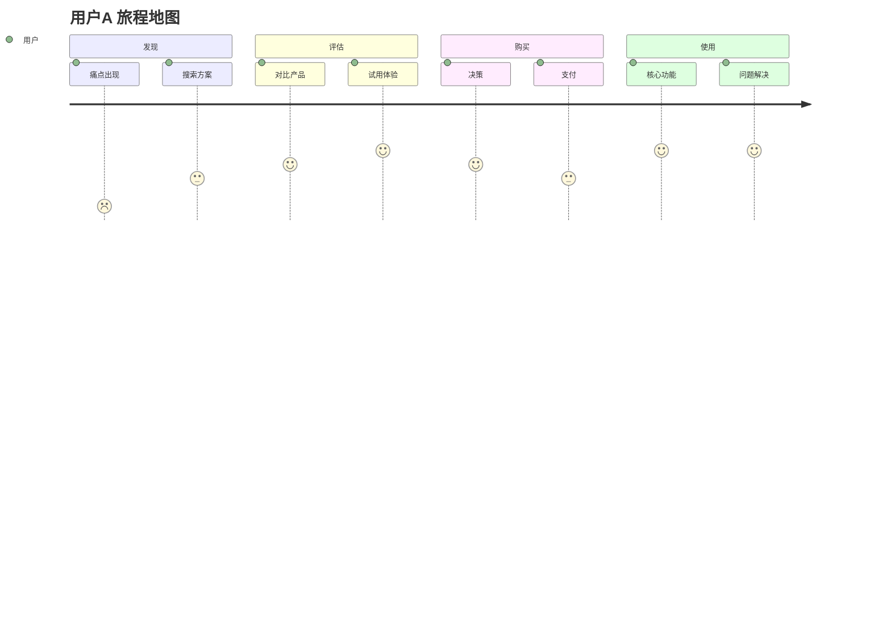

# MRD 市场需求文档模板

> Market Requirement Document - 市场需求文档

## 文档信息

| 字段 | 内容 |
|------|------|
| 项目名称 | {{project_name}} |
| 版本 | V1.0 |
| 创建日期 | {{date}} |
| 作者 | {{author}} |
| 状态 | DRAFT / REVIEW / APPROVED |

---

## 1. 用户分析

### 1.1 用户画像

| 角色 | 人口统计 | 目标 | 痛点 | 场景 |
|------|----------|------|------|------|
| **用户A** | {{demo_a}} | {{goal_a}} | {{pain_a}} | {{scenario_a}} |
| **用户B** | {{demo_b}} | {{goal_b}} | {{pain_b}} | {{scenario_b}} |
| **用户C** | {{demo_c}} | {{goal_c}} | {{pain_c}} | {{scenario_c}} |

### 1.2 用户旅程地图



### 1.3 需求优先级矩阵

```
                    高频 ←----→ 低频
                ┌─────────┬─────────┐
         强痛点 │   P0    │   P1    │
  痛点  ├─────────┼─────────┤
         弱痛点 │   P2    │   P3    │
                └─────────┴─────────┘
需求程度：P0=立即解决 P1=下版本 P2=规划中 P3=观望
```

---

## 2. 竞品分析

### 2.1 竞品对比矩阵

| 维度 | {{project}} | 竞品A | 竞品B | 竞品C |
|------|-------------|-------|-------|-------|
| 定价 | {{val}} | ¥{{a}} | ¥{{b}} | ¥{{c}} |
| 核心功能 | ✓ | ✓ | ✗ | ✓ |
| 用户体验 | {{rating}} | {{a}} | {{b}} | {{c}} |
| 集成能力 | {{val}} | {{a}} | {{b}} | {{c}} |
| 客户支持 | {{val}} | {{a}} | {{b}} | {{c}} |

### 2.2 差异化机会

| 机会 | 竞品缺陷 | 我方优势 |
|------|----------|----------|
| {{opp_1}} | {{gap}} | {{advantage}} |
| {{opp_2}} | {{gap}} | {{advantage}} |

### 2.3 竞品用户反馈

| 竞品 | 用户反馈源 | 核心诉求 |
|------|-----------|----------|
| 竞品A | {{source}} | {{feedback}} |
| 竞品B | {{source}} | {{feedback}} |

---

## 3. 市场分析

### 3.1 市场细分

| 细分市场 | 规模 | 增长性 | 利润率 | 优先级 |
|----------|------|--------|--------|--------|
| {{seg_1}} | {{size}} | {{growth}} | {{margin}} | P{{priority}} |
| {{seg_2}} | {{size}} | {{growth}} | {{margin}} | P{{priority}} |

### 3.2 渠道分析

| 渠道 | 获客成本 | 转化率 | 优先级 |
|------|----------|--------|--------|
| SEM | ¥{{cac}} | {{conv}}% | P{{priority}} |
| 内容营销 | ¥{{cac}} | {{conv}}% | P{{priority}} |
| 社交营销 | ¥{{cac}} | {{conv}}% | P{{priority}} |

---

## 4. 功能需求映射

### 4.1 用户需求 → 功能映射

| 用户需求 | 需求来源 | 功能点 | 优先级 | 竞品支持 |
|---------|----------|--------|--------|----------|
| {{need}} | {{source}} | {{feature}} | P{{priority}} | {{competitor}} |

### 4.2 功能需求清单

| ID | 功能 | 描述 | 优先级 | 依赖 |
|----|------|------|--------|------|
| F-01 | {{feature}} | {{desc}} | P0 | - |
| F-02 | {{feature}} | {{desc}} | P1 | F-01 |

---

## 5. 商业需求

### 5.1 定价策略

| 方案 | 价格 | 目标用户 | 预计销量 |
|------|------|----------|----------|
| 免费版 | 免费 | {{users}} | {{volume}} |
| 专业版 | ¥{{price}} | {{users}} | {{volume}} |
| 企业版 | ¥{{price}} | {{users}} | {{volume}} |

### 5.2 收入预测

| 年份 | 付费用户数 | ARPU | 收入 |
|------|------------|------|------|
| Y1 | {{users}} | ¥{{arpu}} | ¥{{rev}} |
| Y2 | {{users}} | ¥{{arpu}} | ¥{{rev}} |
| Y3 | {{users}} | ¥{{arpu}} | ¥{{rev}} |

---

## 6. 成功标准

### 6.1 市场成功指标

| 指标 | 目标 | 衡量方式 | 时间点 |
|------|------|----------|--------|
| 市场份额 | {{target}}% | 行业报告 | {{date}} |
| 用户满意度 | {{target}} | NPS | {{date}} |
| 客户留存率 | {{target}}% | 财务数据 | {{date}} |

### 6.2 风险缓解

| 风险 | 触发条件 | 缓解措施 |
|------|----------|----------|
| {{risk}} | {{trigger}} | {{mitigation}} |

---

## 7. 附录

### 7.1 调研数据

| 调研方式 | 样本量 | 关键发现 |
|----------|--------|----------|
| 用户访谈 | {{n}} | {{finding}} |
| 问卷调研 | {{n}} | {{finding}} |
| 数据分析 | {{n}} | {{finding}} |

### 7.2 参考链接

| 链接 | 说明 |
|------|------|
| {{link}} | {{desc}} |

---

**审批记录**

| 角色 | 签字 | 日期 |
|------|------|------|
| 产品负责人 | | |
| 市场负责人 | | |