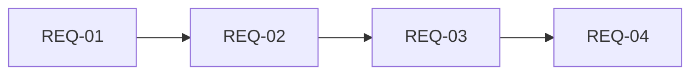

# 原始需求清单

> 需求池管理 - 原始需求收集

## 项目信息

| 字段 | 内容 |
|------|------|
| 项目名称 | {{project_name}} |
| 创建日期 | {{date}} |
| 产品负责人 | {{owner}} |

---

## 1. 需求收集

### 1.1 来源清单

| 编号 | 需求来源 | 描述 | 提交人 | 提交日期 |
|------|----------|------|--------|----------|
| REQ-001 | {{source}} | {{desc}} | {{submitter}} | {{date}} |
| REQ-002 | {{source}} | {{desc}} | {{submitter}} | {{date}} |

### 1.2 来源类型

| 类型 | 说明 | 示例 |
|------|------|------|
| 用户访谈 | 直接来源于用户 | 用户反馈某个功能不好用 |
| 问卷调研 | 用户调研数据 | 问卷中 80% 用户希望增加 X 功能 |
| 竞品分析 | 竞品功能拆解 | 竞品有 A 功能，我方需支持 |
| 数据分析 | 业务数据分析 | 转化率漏斗显示某步流失严重 |
| 技术演进 | 技术优化需求 | 性能不足需重构 |
| 业务需求 | 运营/业务方提出 | 运营活动需上线专题页 |
| 战略需求 | 公司战略对齐 | 响应公司数字化战略 |

---

## 2. 需求分类

### 2.1 按类型分类

| 类型 | 需求数 | 占比 |
|------|--------|------|
| 功能需求 | {{count}} | {} |
| 性能需求 | {{count}} | {} |
| 合规需求 | {{count}} | {{%}} |

### 2.2 按模块分类

| 模块 | 需求数 | 优先级 |
|------|--------|--------|
| {{module_1}} | {{count}} | P{{priority}} |
| {{module_2}} | {{count}} | P{{priority}} |
| {{module_3}} | {{count}} | P{{priority}} |

---

## 3. 需求评估

### 3.1 优先级评估

| 维度 | P0（紧急）| P1（高）| P2（中）| P3（低）|
|------|-----------|---------|---------|---------|
| 业务价值 | | | | |
| 用户影响 | | | | |
| 实现难度 | | | | |
| 依赖关系 | | | | |

### 3.2 估算工时

| ID | 功能 | 复杂度 | 前端工时 | 后端工时 | 测试工时 |
|----|------|--------|----------|----------|----------|
| REQ-01 | {{feature}} | {{complex}} | {{hours}} | {{hours}} | {{hours}} |

---

## 4. 需求依赖

### 4.1 依赖关系矩阵

| REQ-ID | 依赖 REQ | 依赖说明 |
|--------|----------|----------|
| REQ-01 | - | 无依赖 |
| REQ-02 | REQ-01 | 依赖 REQ-01 完成 |
| REQ-03 | REQ-02 | 依赖 REQ-02 完成 |

### 4.2 全量依赖图

---

## 5. 需求状态

### 5.1 状态定义

| 状态 | 说明 |
|------|------|
| 收集 | 新需求，待评审 |
| 评审 | 需求评审中 |
| 规划 | 已规划进入版本 |
| 开发 | 开发中 |
| 测试 | 测试中 |
| 完成 | 已上线 |
| 拒绝 | 已拒绝 |

### 5.2 需求进度

| 版本 | REQ 数量 | 状态分布 |
|------|----------|----------|
| V1.0 | {{n}} | 规划: {{n}} / 开发: {{n}} |
| V1.1 | {{n}} | 规划: {{n}} / 开发: {{n}} |

---

## 6. 需求变更

### 6.1 变更记录

| 变更单号 | 原需求 | 变更内容 | 变更原因 | 审批人 | 日期 |
|----------|--------|----------|----------|--------|------|
| CR-001 | REQ-01 | {{change}} | {{reason}} | {{approver}} | {{date}} |

---

**维护记录**

| 日期 | 操作人 | 变更内容 |
|------|--------|----------|
| {{date}} | {{operator}} | {{change}} |