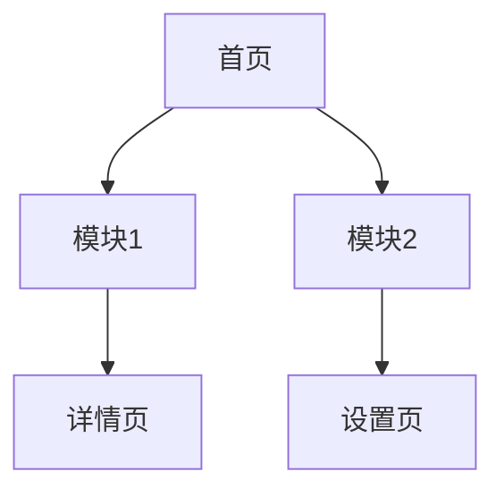
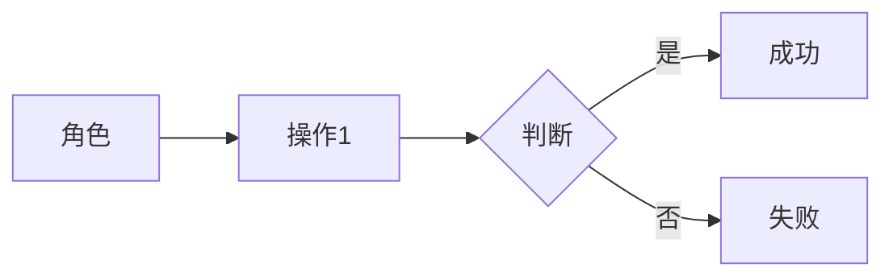
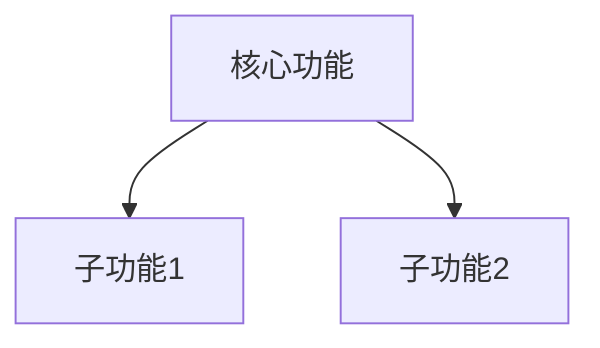
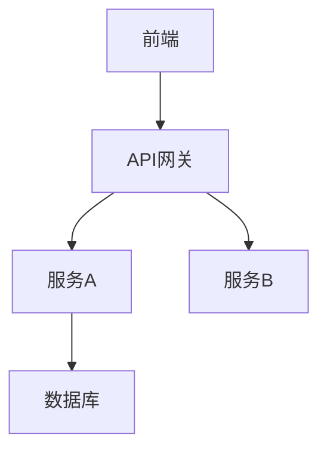

# PRD 产品需求文档（完整版）

> Product Requirement Document - 产品需求文档

## 文档信息

| 字段 | 内容 |
|------|------|
| 项目名称 | {{project_name}} |
| 版本 | V1.0 |
| 创建日期 | {{date}} |
| 作者 | {{author}} |
| 状态 | DRAFT / REVIEW / APPROVED |
| 知识引用 | {{knowledge_id}} |

---

## 0. 执行摘要

### 0.1 问题陈述

| 角色 | 痛点 | 现状成本 | 目标 |
|------|------|----------|------|
| {{role}} | {{pain}} | {{cost}} | {{goal}} |

### 0.2 解决方案

**核心方案**：
{{solution}}

**相较竞品优势**：
{{advantage}}

### 0.3 关键假设

| 假设 | 验证方式 | 风险等级 |
|------|----------|----------|
| {{assumption}} | {{verification}} | {{risk}} |

### 0.4 成功指标

| 指标 | 目标 | 衡量方式 | 时间点 |
|------|------|----------|--------|
| {{metric}} | {{target}} | {{method}} | {{date}} |

---

## 1. 业务背景

### 1.1 行业背景

*(引用自知识库：行业概览)*
{{industry_background}}

### 1.2 行业挑战

*(引用自知识库：行业挑战)*
| 挑战 | 描述 | 机会 |
|------|------|------|
| {{challenge}} | {{desc}} | {{opp}} |

### 1.3 产品目标

| 目标 | 量化指标 | 责任人 |
|------|----------|--------|
| {{goal}} | {{metric}} | {{owner}} |

---

## 2. 产品概述

### 2.1 产品定位

> {{positioning_statement}}

### 2.2 目标用户

| 角色 | 描述 | 使用场景 | 优先级 |
|------|------|----------|--------|
| {{role}} | {{desc}} | {{scenario}} | P{{priority}} |

### 2.3 产品范围

**包含**：
- {{include_1}}
- {{include_2}}

**不包含**：
- {{exclude_1}}
- {{exclude_2}}

### 2.4 竞品分析

*(引用自知识库)*
| 竞品 | 核心优势 | 核心劣势 | 差异化 |
|------|----------|----------|--------|
| {{comp}} | {{adv}} | {{disadv}} | {{diff}} |

---

## 3. 市场研究

### 3.1 竞品分析详报

*(引用自知识库)*
| 竞品/方案 | 核心能力 | 用户评价 | 可借鉴点 |
|----------|---------|-----------|----------|
| {{comp}} | {{capability}} | {{feedback}} | {{learn}} |

### 3.2 行业最佳实践

*(引用自知识库)*
| 实践 | 描述 | 适用性 |
|------|------|--------|
| {{practice}} | {{desc}} | {{applicability}} |

### 3.3 技术方案参考

| 方案 | 技术特点 | 适用场景 | 风险 |
|------|----------|----------|------|
| {{solution}} | {{feature}} | {{scenario}} | {{risk}} |

---

## 4. 产品设计

### 4.1 信息架构



### 4.2 核心页面设计

| 页面 | 功能 | 关键组件 |
|------|------|----------|
| {{page}} | {{feature}} | {{component}} |

### 4.3 交互流程

{{interaction_flow}}

### 4.4 设计规范

*(引用自知识库：设计系统)*
| 规范项 | 要求 |
|--------|------|
| {{item}} | {{requirement}} |

---

## 5. 用户故事

### 5.1 用户角色与权限

| 角色 | 描述 | 权限 |  |
|------|------|------|--|
| {{role}} | {{desc}} | {{permission}} |  |

### 5.2 用户故事矩阵

| ID | 角色 | 故事 | 验收标准 | 优先级 |
|----|------|------|----------|--------|
| US-001 | {{role}} | {{story}} | {{acceptance}} | P{{priority}} |

### 5.3 业务流程



### 5.4 异常场景

| 场景 | 预期处理 | 反馈 |
|------|----------|------|
| {{scenario}} | {{handling}} | {{feedback}} |

---

## 6. 功能规划

### 6.1 功��架构



### 6.2 功能列表

| 模块 | 功能点 | 功能描述 | 优先级 | 权限要求 | 依赖 |
|------|--------|----------|--------|----------|------|
| {{module}} | {{feature}} | {{desc}} | P{{priority}} | {{permission}} | {{dependency}} |

### 6.3 版本规划

| 版本 | 范围 | 交付时间 | 里程碑 |
|------|------|----------|--------|
| MVP | P0功能 | {{date}} | 核心可用 |
| V1.0 | P0+P1 | {{date}} | 功能完善 |
| V1.1 | P2功能 | {{date}} | 体验优化 |

---

## 7. 技术方案

### 7.1 系统架构图

*(引用自知识库：技术选型)*


### 7.2 技术栈

*(引用自知识库)*
| 层级 | 技术 | 版本 |
|------|------|------|
| {{layer}} | {{tech}} | {{version}} |

### 7.3 数据模型

| 实体 | 字段 | 类型 | 说明 |
|------|------|------|------|
| {{entity}} | {{field}} | {{type}} | {{desc}} |

### 7.4 接口设计

> **统一异步任务响应范式**

```json
{
  "task_id": "string",
  "status": "pending|running|completed|failed",
  "progress": 0-100,
  "result": {},
  "error": {}
}
```

| 接口 | 方法 | 路径 | 说明 |
|------|------|------|------|
| {{api}} | {{method}} | {{path}} | {{desc}} |

---

## 8. 非功能需求

### 8.1 性能要求

*(引用自知识库)*
| 指标 | 要求 | 行业标准 |
|------|------|----------|
| {{metric}} | {{target}} | {{benchmark}} |

### 8.2 可用性

| 指标 | 要求 |
|------|------|
| 可用性 | {{target}}% |
| MTBF | {{value}} |
| MTTR | {{value}} |

### 8.3 安全

*(引用自知识库)*
| 要求 | 说明 |
|------|------|
| {{item}} | {{desc}} |

### 8.4 合规

*(引用自知识库)*
| 法规 | 要求 | 当前状态 |
|------|------|----------|
| {{regulation}} | {{requirement}} | {{status}} |

---

## 9. 风险评估

### 9.1 技术风险

| 风险 | 影响 | 概率 | 应对措施 |
|------|------|------|----------|
| {{risk}} | {{impact}} | {{prob}} | {{mitigation}} |

### 9.2 业务风险

| 风险 | 影响 | 应对措施 |
|------|------|----------|
| {{risk}} | {{impact}} | {{mitigation}} |

### 9.3 依赖项

| 依赖方 | 内容 | 交付时间 | 风险 |
|--------|------|----------|------|
| {{dep}} | {{content}} | {{date}} | {{risk}} |

---

## 10. 决策日志

| 决策 | 选择 | 替代方案 | 理由 |
|------|------|----------|------|
| {{decision}} | {{choice}} | {{alternative}} | {{reason}} |

---

## 11. 附录

### 11.1 术语表

*(引用自知识库)*
| 术语 | 定义 |
|------|------|
| {{term}} | {{definition}} |

### 11.2 参考文档

| 文档 | 链接 |
|------|------|
| {{doc}} | {{link}} |

---

**审批记录**

| 角色 | 签字 | 日期 |
|------|------|------|
| 产品负责人 | | |
| 技术负责人 | | |
| 业务负责人 | |