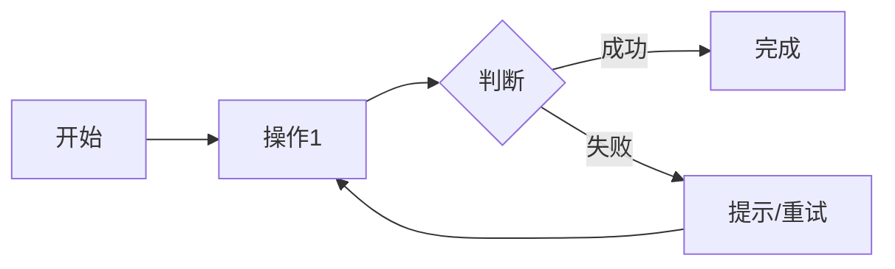

# PRD 产品需求文档（精简版）

> Product Requirement Document - 7 章精简结构

## 文档信息

| 字段 | 内容 |
|------|------|
| 项目名称 | {{project_name}} |
| 版本 | V1.0 |
| 创建日期 | {{date}} |
| 作者 | {{author}} |
| 状态 | DRAFT / APPROVED / IN_REVIEW |

---

## 1. 概述

### 1.1 问题与方案

| 维度 | 内容 |
|------|------|
| **核心问题** | {{problem}} - 谁有什么痛点，不解决会怎样？ |
| **解决方案** | {{solution}} - 我们提供什么来解决这个问题？ |
| **目标用户** | {{target_users}} - 谁会使用这个功能？ |
| **差异化** | {{differentiation}} - 与现有方案有何不同？ |

### 1.2 成功指标

| 指标 | 目标 | 衡量方式 |
|------|------|----------|
| {{metric_1}} | {{target}} | {{method}} |
| {{metric_2}} | {{target}} | {{method}} |

---

## 2. 背景

### 2.1 业务背景

> 为什么会产生这个需求？有什么背景信息？

- **业务场景**：{{business_scenario}}
- **用户痛点**：{{pain_points}}
- **现有方案**：{{existing_solution}}
- **为什么现在做**：{{why_now}}

### 2.2 假设与约束

| 假设 | 说明 |
|------|------|
| {{assumption_1}} | {{desc}} |
| {{assumption_2}} | {{desc}} |

---

## 3. 需求

### 3.1 MVP 功能

| 功能 | 优先级 | 描述 |
|------|--------|------|
| {{feature_1}} | P0 | {{desc}} |
| {{feature_2}} | P0 | {{desc}} |
| {{feature_3}} | P1 | {{desc}} |

### 3.2 Must / Should / Could

| 类别 | 内容 |
|------|------|
| **Must（必须）** | {{must_items}} |
| **Should（应该）** | {{should_items}} |
| **Could（可选）** | {{could_items}} |

### 3.3 不包含

> 明确不包含什么，以管理预期

- {{exclusion_1}}
- {{exclusion_2}}

---

## 4. 体验

### 4.1 用户流程

### 4.2 核心页面

| 页面 | 关键功能 | 备注 |
|------|----------|------|
| {{page_1}} | {{feature}} | {{note}} |
| {{page_2}} | {{feature}} | {{note}} |

### 4.3 交互原型

> 链接到 Figma/原型工具（如有）
- 原型链接：{{prototype_url}}

---

## 5. 验收标准 ⭐

> **关键章节**：每个用户故事的验收标准，使用 Given/When/Then 格式

### 5.1 用户故事

| ID | 用户故事 | 验收标准 |
|----|----------|----------|
| US-01 | 作为 {{用户}}，我希望 {{功能}}，以便 {{价值}} | 见下方 |
| US-02 | ... | ... |

### 5.2 验收标准示例

**US-01 验收标准**：

| 场景 | Given（前提） | When（操作） | Then（期望） |
|------|--------------|--------------|--------------|
| 正常 | 用户已登录 | 点击"创建"按钮 | 弹出创建表单 |
| 异常 | 用户未登录 | 点击"创建"按钮 | 跳转登录页面 |
| 边界 | 表单字段为空 | 点击"提交" | 显示校验错误 |

### 5.3 DoR 检查

| 检查项 | 状态 |
|--------|------|
| 验收标准使用 Given/When/Then 格式 | ⬜ |
| 用户故事满足 INVEST 标准 | ⬜ |
| 无阻塞依赖（或依赖已解决） | ⬜ |
| UI/UX 设计稿已提供（如有界面变更） | ⬜ |
| 技术方案已确认（如有架构变更） | ⬜ |

---

## 6. 时间线

### 6.1 里程碑

| 里程碑 | 日期 | 交付内容 |
|--------|------|----------|
| M1: 需求确认 | {{date}} | PRD 评审通过 |
| M2: 设计完成 | {{date}} | UI/UX 定稿、技术方案确定 |
| M3: 开发完成 | {{date}} | 代码提交、测试通过 |
| M4: 上线 | {{date}} | 生产环境部署 |

### 6.2 依赖

| 依赖项 | 依赖方 | 截止日期 |
|--------|--------|----------|
| {{dependency}} | {{team}} | {{date}} |

---

## 7. 利益相关者

### 7.1 核心团队

| 角色 | 人员 | 职责 |
|------|------|------|
| 产品负责人 | {{name}} | 产品决策、需求确认 |
| 技术负责人 | {{name}} | 技术方案、架构设计 |
| 设计负责人 | {{name}} | UI/UX 设计 |
| 测试负责人 | {{name}} | 测试计划、用例设计 |

### 7.2 干系人

| 干系人 | 关注点 | 沟通方式 |
|--------|--------|----------|
| {{stakeholder}} | {{concern}} | {{method}} |

### 7.3 审批记录

| 角色 | 签字 | 日期 | 意见 |
|------|------|------|------|
| 产品负责人 | | | |
| 技术负责人 | | | |
| 设计负责人 | | | |

---

**文档版本历史**

| 版本 | 日期 | 修改人 | 修改内容 |
|------|------|--------|----------|
| V1.0 | {{date}} | {{author}} | 初始版本 |