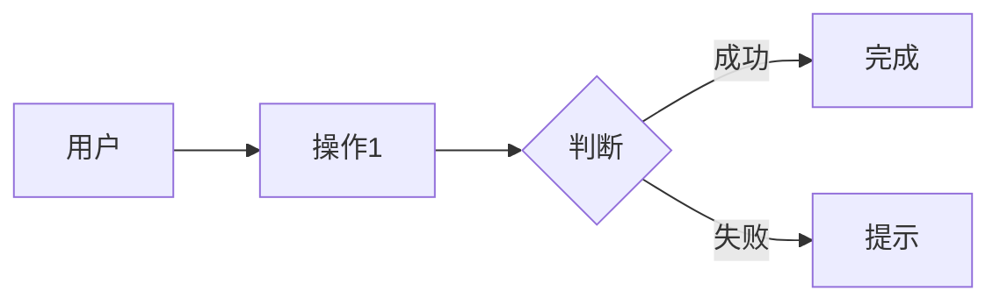

# PRD 产品需求文档（精简版）

> Product Requirement Document - 精简版

## 文档信息

| 字段 | 内容 |
|------|------|
| 项目名称 | {{project_name}} |
| 版本 | V1.0 |
| 创建日期 | {{date}} |
| 作者 | {{author}} |
| 状态 | DRAFT / APPROVED |

---

## 1. 核心信息

### 1.1 问题与方案

| 维度 | 内容 |
|------|------|
| **核心问题** | {{problem}} |
| **解决方案** | {{solution}} |
| **目标用户** | {{target_users}} |
| **差异化** | {{differentiation}} |

### 1.2 成功指标

| 指标 | 目标 | 衡量方式 |
|------|------|----------|
| {{metric_1}} | {{target}} | {{method}} |
| {{metric_2}} | {{target}} | {{method}} |

---

## 2. 功能范围

### 2.1 MVP 功能

| 功能 | 优先级 | 描述 |
|------|--------|------|
| {{feature_1}} | P0 | {{desc}} |
| {{feature_2}} | P0 | {{desc}} |
| {{feature_3}} | P1 | {{desc}} |

### 2.2 不包含

- {{exclusion_1}}
- {{exclusion_2}}

---

## 3. 用户流程

---

## 4. 核心页面

| 页面 | 关键功能 | 备注 |
|------|----------|------|
| {{page}} | {{feature}} | {{note}} |

---

## 5. 技术方案

| 维度 | 选择 |
|------|------|
| 前端框架 | {{frontend}} |
| 后端框架 | {{backend}} |
| 数据库 | {{database}} |
| 第三方服务 | {{third_party}} |

---

## 6. 数据模型

| 实体 | 核心字段 | 说明 |
|------|----------|------|
| {{entity}} | {{fields}} | {{desc}} |

---

## 7. 接口

| 接口 | 方法 | 路径 | 说明 |
|------|------|------|------|
| {{api}} | {{method}} | {{path}} | {{desc}} |

---

## 8. 非功能需求

| 指标 | 要求 |
|------|------|
| 响应时间 | <{{time}}ms |
| 可用性 | >{{availability}}% |
| 并发 | {{concurrency}} |

---

## 9. 里程碑

| 里程碑 | 日期 | 交付内容 |
|---------|------|----------|
| {{milestone}} | {{date}} | {{delivery}} |

---

## 10. 风险

| 风险 | 缓解措施 |
|------|----------|
| {{risk}} | {{mitigation}} |

---

**审批记录**

| 角色 | 签字 | 日期 |
|------|------|------|
| 产品负责人 | | |
| 技术负责人 | |