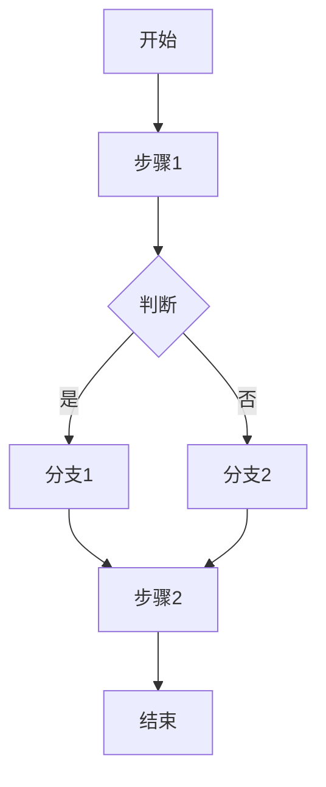
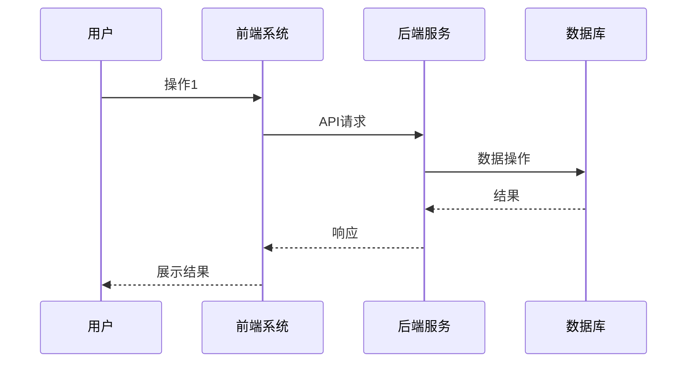
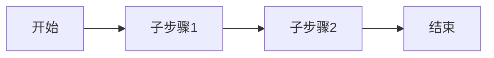
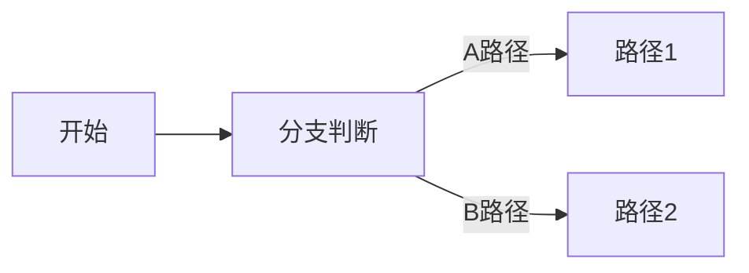
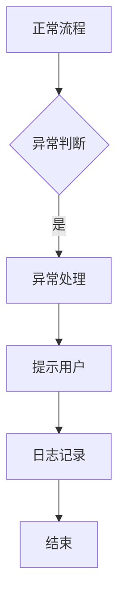

# 业务流程图 / 泳道图

> Business Flow Diagram / Swimlane Diagram

## 文档信息

| 字段 | 内容 |
|------|------|
| 项目名称 | {{project_name}} |
| 版本 | V1.0 |
| 创建日期 | {{date}} |

---

## 1. 业务流程总图

### 1.1 核心业务流程

### 1.2 流程说明

| 步骤 | 操作 | 输入 | 输出 | 异常处理 |
|------|------|------|------|-----------|
| {{step}} | {{action}} | {{input}} | {{output}} | {{error_handling}} |

---

## 2. 泳道图（角色分工）

### 2.1 主流程泳道图

### 2.2 角色职责

| 角色 | 职责 | 权限 |
|------|------|------|
| {{role}} | {{responsibility}} | {{permission}} |

---

## 3. 子流程图

### 3.1 子流程A

### 3.2 子流程B

---

## 4. 异常流程

### 4.1 异常场景

| 场景 | 触发条件 | 处理流程 | 提示 |
|------|----------|----------|------|
| {{scenario}} | {{trigger}} | {{flow}} | {{message}} |

### 4.2 异常流程图

---

## 5. 流程说明文档

### 5.1 业务规则

| 规则ID | 规则描述 | 优先级 |
|--------|----------|--------|
| {{rule_id}} | {{description}} | P{{priority}} |

### 5.2 关键决策点

| 决策点 | 条件 | 结果 |
|--------|------|------|
| {{decision}} | {{condition}} | {{result}} |

---

## 6. 流程版本记录

| 版本 | 日期 | 变更内容 | 变更人 |
|------|------|----------|--------|
| V1.0 | {{date}} | 初始版本 | {{author}} |