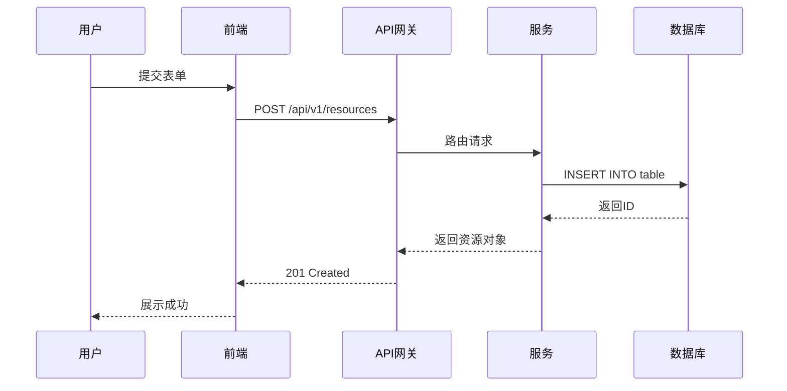
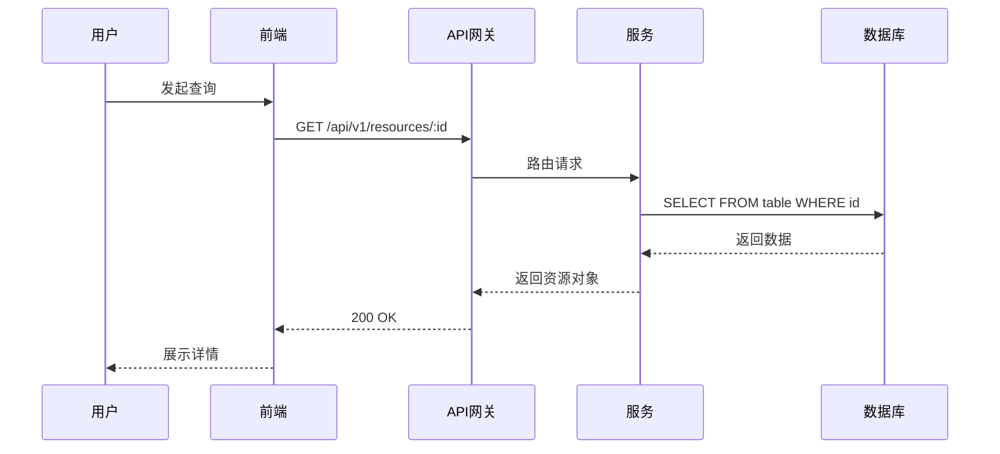
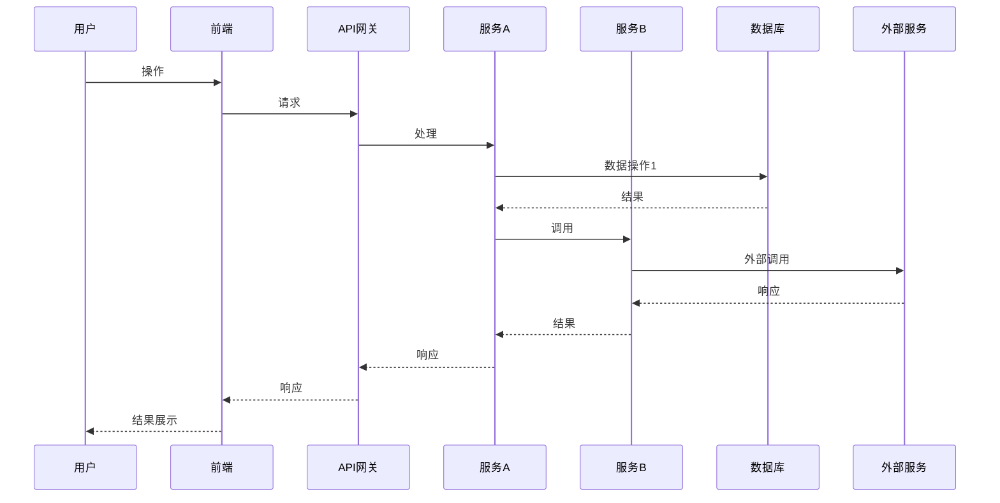
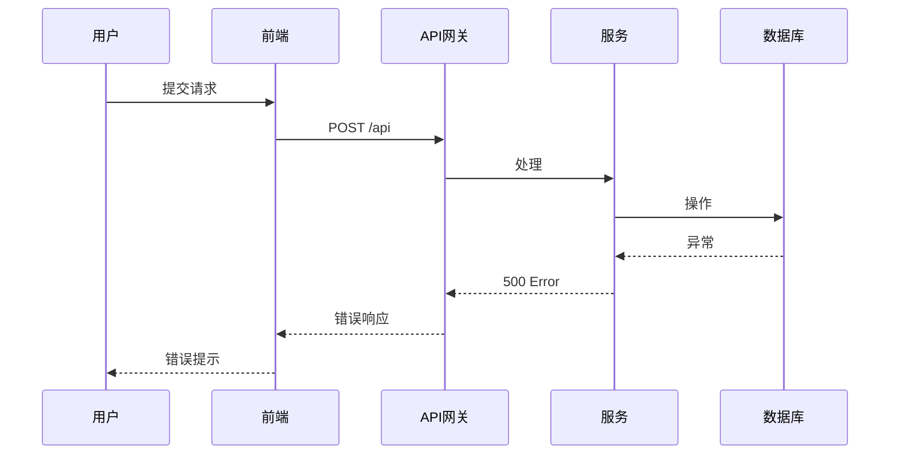
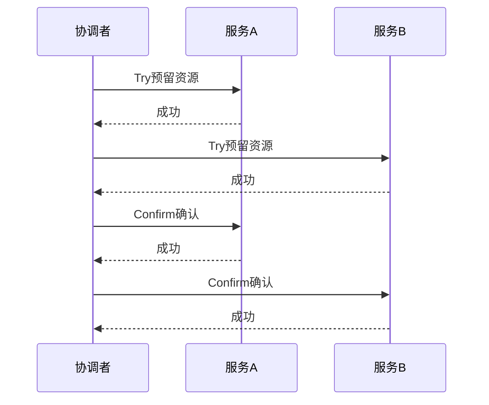
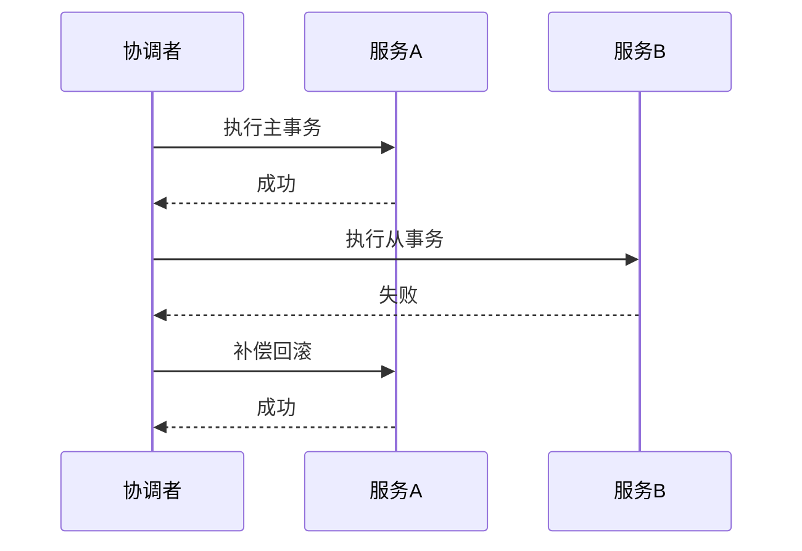
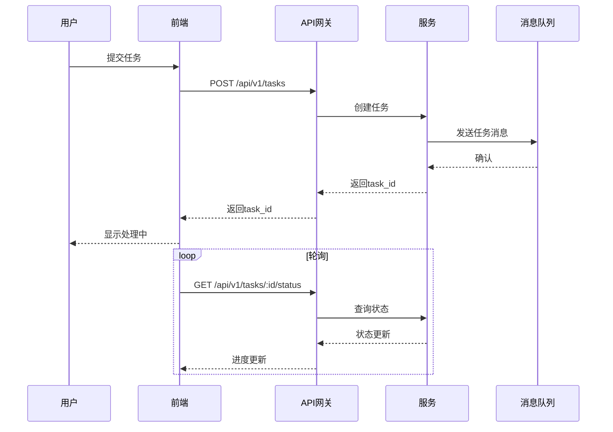

# 系统时序图 / 交互图

> Sequence Diagram / Interaction Diagram

## 文档信息

| 字段 | 内容 |
|------|------|
| 项目名称 | {{project_name}} |
| 版本 | V1.0 |
| 创建日期 | {{date}} |

---

## 1. 核心接口时序图

### 1.1 创建资源时序

### 1.2 查询资源时序

---

## 2. 业务场景时序

### 2.1 场景A：{{scenario_a}}

### 2.2 异常处理时序

---

## 3. 分布式事务时序（如需）

### 3.1 TCC 模式

### 3.2 补偿模式

---

## 4. 异步任务时序

### 4.1 任务创建与轮询

---

## 5. 时序图组件说明

### 5.1 参与者定义

| 参与者 | 类型 | 说明 |
|--------|------|------|
| {{participant}} | 前端/后端/DB/外部 | {{description}} |

### 5.2 消息类型

| 类型 | 表示 | 说明 |
|------|------|------|
| 同步请求 | `->>` | 等待响应 |
| 异步消息 | `-->>` | 不等待响应 |
| 返回 | `-->>` | 响应结果 |

---

## 6. 版本记录

| 版本 | 日期 | 变更内容 | 变更人 |
|------|------|----------|--------|
| V1.0 | {{date}} | 初始版本 | {{author}} |