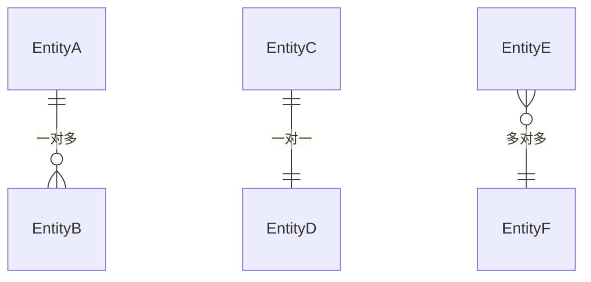

# 业务数据字典

> Business Data Dictionary

## 文档信息

| 字段 | 内容 |
|------|------|
| 项目名称 | {{project_name}} |
| 版本 | V1.0 |
| 创建日期 | {{date}} |

---

## 1. 数据实体

### 1.1 实体清单

| 实体名 | 中文名 | 说明 | 关联实体 |
|--------|--------|------|----------|
| {{entity}} | {{name_cn}} | {{desc}} | {{relation}} |

---

## 2. 字段定义

### 2.1 {{entity}} 表

| 字段名 | 字段类型 | 必填 | 默认值 | 说明 | 校验规则 |
|--------|----------|------|--------|------|----------|
| {{field}} | {{type}} | {{required}} | {{default}} | {{desc}} | {{rule}} |

### 2.1.1 字段类型说明

| 类型 | 数据库类型 | 说明 |
|------|------------|------|
| 字符串 | VARCHAR(255) | 文本 |
| 整数 | BIGINT | 数字 |
| 小数 | DECIMAL(10,2) | 金额 |
| 日期 | DATETIME | 时间 |
| 枚举 | INT | 枚举值 |
| JSON | JSON | JSON 对象 |

---

## 3. 枚举定义

### 3.1 枚举清单

| 枚举名 | 枚举值 | 说明 |
|--------|--------|------|
| {{enum_name}} | {{values}} | {{desc}} |

### 3.2 {{enum_name}} 详细

| 值 | 显示名 | 说明 |
|----|--------|------|
| {{value}} | {{label}} | {{desc}} |

---

## 4. 索引定义

### 4.1 {{entity}} 表索引

| 索引名 | 类型 | 字段 | 唯一 | 说明 |
|--------|------|------|------|------|
| {{idx_name}} | {{type}} | {{fields}} | {{unique}} | {{desc}} |

### 4.2 索引类型说明

| 类型 | 说明 | 使用场景 |
|------|------|----------|
| PRIMARY | 主键 | id 字段 |
| UNIQUE | 唯一索引 | 唯一性约束字段 |
| INDEX | 普通索引 | 查询优化 |
| FULLTEXT | 全文索引 | 文本搜索 |

---

## 5. 关联关系

### 5.1 ER 图

### 5.2 关联说明

| 实体A | 实体B | 关系类型 | 外键字段 |
|--------|----------|----------|----------|
| {{entity_a}} | {{entity_b}} | {{type}} | {{foreign_key}} |

---

## 6. 数据权限

### 6.1 字段级权限

| 字段 | 可读角色 | 可写角色 | 脱敏规则 |
|------|----------|----------|----------|
| {{field}} | {{read_role}} | {{write_role}} | {{mask}} |

### 6.2 脱敏规则说明

| 规则 | 示例 | 说明 |
|------|------|------|
| 手机号 | 138****1234 | 中间脱敏 |
| 身份证 | 3101**********1234 | 前后保留中间脱敏 |
| 金额 | **.00 | 金额脱敏 |

---

## 7. 数据质量规则

### 7.1 质量规则

| 规则 | 字段 | 规则定义 | 告警级别 |
|------|------|----------|----------|
| {{rule}} | {{field}} | {{definition}} | {{level}} |

---

## 8. 版本记录

| 版本 | 日期 | 变更内容 | 变更人 |
|------|------|----------|--------|
| V1.0 | {{date}} | 初始版本 | {{author}} |