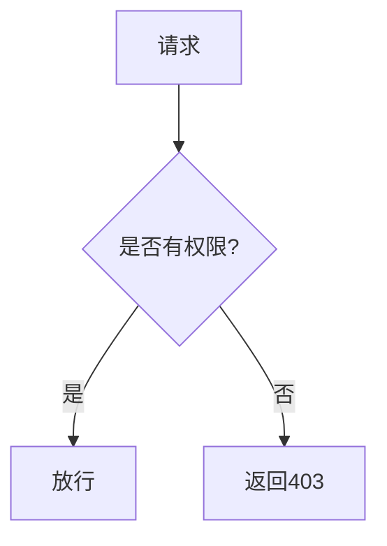

# 权限体系设计

> Permission System Design

## 文档信息

| 字段 | 内容 |
|------|------|
| 项目名称 | {{project_name}} |
| 版本 | V1.0 |
| 创建日期 | {{date}} |

---

## 1. 角色定义

### 1.1 角色清单

| 角色编码 | 角色名称 | 角色描述 | 权限级别 |
|----------|----------|------|----------|
| {{role_code}} | {{role_name}} | {{description}} | {{level}} |

### 1.2 角色层级

```
{{role_super}}
  └─ {{role_admin}}
      ├─ {{role_manager}}
      │   └─ {{role_user}}
      └─ {{role_viewer}}
```

---

## 2. 权限定义

### 2.1 权限清单

| 权限编码 | 权限名称 | 资源类型 | 操作类型 |
|----------|----------|----------|----------|
| {{perm_code}} | {{perm_name}} | {{resource}} | {{action}} |

### 2.2 权限类型

| 操作类型 | 权限码后缀 | 说明 |
|----------|-----------|------|
| 查询 | :query | 查看、列表、详情 |
| 创建 | :create | 新增 |
| 更新 | :update | 修改 |
| 删除 | :delete | 删除 |
| 导出 | :export | 导出数据 |
| 管理 | :admin | 管理配置 |

---

## 3. 角色权限矩阵

### 3.1 权限配置

| 角色 | 权限1 | 权限2 | 权限3 | 权限4 |
|------|-------|-------|-------|-------|
| {{role}} | ✓ | ✓ | ✗ | ✓ |

### 3.2 详细权限

```
角色: {{role}}
├── 模块A
│   ├── 权限1: ✓
│   └── 权限2: ✓
├── 模块B
│   └── 权限3: ✗
└── 模块C
    └── 权限4: ✓ (仅管理员)
```

---

## 4. 数据权限

### 4.1 数据范围

| 角色 | 数据范围 | 说明 |
|------|----------|------|
| {{role}} | {{scope}} | {{desc}} |

### 4.2 数据范围类型

| 类型 | 说明 | 示例 |
|------|------|------|
| 全部 | 可访问所有数据 | 超级管理员 |
| 部门 | 仅本部门数据 | 部门管理员 |
| 个人 | 仅本人数据 | 普通用户 |
| 指定 | 仅指定数据 | 指定人员 |

---

## 5. 权限验证流程

### 5.1 权限检查流程



### 5.2 接口权限注解

```java
// 示例：仅管理员可访问
@RequiresRoles("admin")
@RequiresPermissions("system:user:delete")
@DeleteMapping("/users/{id}")
public void deleteUser() {}

// 示例：多角色任一可访问
@RequiresRoles(value = {"admin", "manager"}, logical = Logical.OR)
@RequiresPermissions("system:user:query")
@GetMapping("/users")
public List<User> listUsers() {}
```

---

## 6. 权限变更记录

### 6.1 变更日志

| 日期 | 角色 | 变更内容 | 变更人 | 审批人 |
|------|------|----------|--------|--------|
| {{date}} | {{role}} | {{change}} | {{operator}} | {{approver}} |

---

## 7. 特殊权限配置

### 7.1 临时权限

| 角色 | 临时权限 | 有效期 | 审批人 |
|------|----------|--------|--------|
| {{role}} | {{perm}} | {{validity}} | {{approver}} |

### 7.2 委托权限

| 委托人 | 受托人 | 委托权限 | 有效期 |
|--------|--------|----------|--------|
| {{delegator}} | {{delegatee}} | {{perm}} | {{validity}} |

---

## 8. 版本记录

| 版本 | 日期 | 变更内容 | 变更人 |
|------|------|----------|--------|
| V1.0 | {{date}} | 初始版本 | {{author}} |