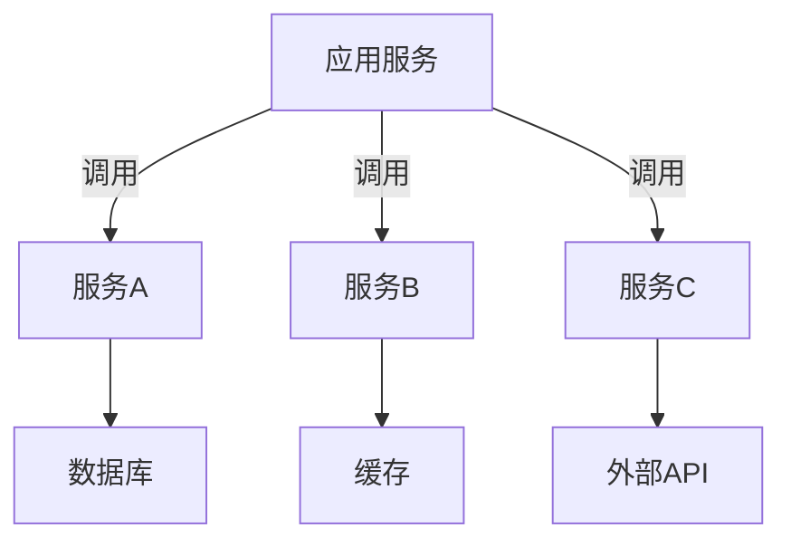

# 第三方依赖清单

> External Dependencies

## 文档信息

| 字段 | 内容 |
|------|------|
| 项目名称 | {{project_name}} |
| 版本 | V1.0 |
| 创建日期 | {{date}} |

---

## 1. 第三方服务概览

### 1.1 服务清单

| 服务名称 | 类型 | 用途 | 优先级 |
|----------|------|------|----------|
| {{service}} | {{type}} | {{usage}} | P{{priority}} |

### 1.2 架构图



---

## 2. 第三方服务详情

### 2.1 {{service_name}}

| 字段 | 内容 |
|------|------|
| 服务商 | {{provider}} |
| 服务类型 | {{type}} |
| SLA | {{sla}} |
| 费用 | {{cost}}年 |
| 配置参数 | {{config}} |

#### 调用示例

```{{language}}
{{code_example}}
```

---

## 3. 集成方案

### 3.1 集成方式

| 服务 | 集成方式 | 协议 | 认证方式 |
|------|----------|------|----------|
| {{service}} | {{method}} | {{protocol}} | {{auth}} |

### 3.2 错误处理

| 错误类型 | 处理策略 |
|----------|----------|
| {{error}} | {{handling}} |

---

## 4. 依赖版本管理

### 4.1 版本清单

| 服务 | 当前版本 | 目标版本 | 更新计划 |
|------|----------|----------|----------|
| {{service}} | {{current}} | {{target}} | {{plan}} |

### 4.2 升级风险

| 服务 | 风险 | 影响 | 缓解措施 |
|------|------|------|----------|
| {{service}} | {{risk}} | {{impact}} | {{mitigation}} |

---

## 5. 费用预算

| 服务 | 计费方式 | 用量估算 | 年费用 |
|------|----------|----------|--------|
| {{service}} | {{billing}} | {{usage}} | ¥{{cost}} |

---

## 6. 备用方案

### 6.1 降级策略

| 服务 | 降级方案 | 触发条件 |
|------|----------|----------|
| {{service}} | {{fallback}} | {{trigger}} |

---

## 7. 版本记录

| 版本 | 日期 | 变更内容 | 变更人 |
|------|------|----------|--------|
| V1.0 | {{date}} | 初始版本 | {{author}} |