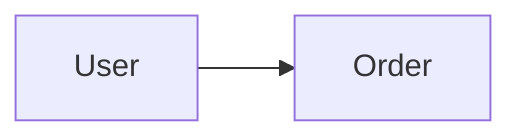
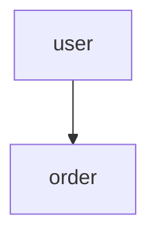

# SOP Scaffold v2.0 - 完整项目初始化流程

## 概述

本 SOP 提供完整的项目初始化流程，确保新项目从需求到代码的全链路标准化。

### 核心特性

- **多 Agent 并行调研**: 5领域 x 2次并行调研
- **架构审核机制**: P0/P1/P2 分级审核
- **PRD 智能判断**: Agent 评估是否需要完整 PRD
- **前后端并行生成**: 多 Agent 同时生成
- **知识库自动索引**: context-mode 全量追踪

### 流程概览

```
┌─────────────────────────────────────────────────────────────────┐
│ Step 1: 需求确认 [CONFIRM_REQUIRED]                              │
│   - 项目名称、核心场景、目标用户、约束条件                        │
└────────────────────────────┬────────────────────────────────────┘
                             ▼
┌─────────────────────────────────────────────────────────────────┐
│ Step 2: 调研 [AUTO - 10次 sop-library-research 并行]            │
│   - 业务分析 x2 | 技术调研 x2 | 安全评估 x2                       │
│   - 竞品分析 x2 | 合规分析 x2                                    │
│   - Agent 评估是否需要 PRD                                       │
└────────────────────────────┬────────────────────────────────────┘
                             ▼
┌─────────────────────────────────────────────────────────────────┐
│ Step 3: 架构设计 [AUTO]                                          │
│   - 分层架构设计                                                  │
│   - 技术选型确认                                                  │
│   - 数据模型设计                                                  │
│   - API 结构设计                                                  │
└────────────────────────────┬────────────────────────────────────┘
                             ▼
┌─────────────────────────────────────────────────────────────────┐
│ Step 4: 架构审核 [CONFIRM_REQUIRED]                              │
│   - P0: 分层架构、技术可行性                                      │
│   - P1: 数据模型、安全设计                                        │
│   - P2: 性能预估、扩展性                                          │
│   - 用户确认/修改                                                 │
└────────────────────────────┬────────────────────────────────────┘
                             ▼
┌─────────────────────────────────────────────────────────────────┐
│ Step 5: PRD生成 [AUTO - Agent判断]                               │
│   - 评估条件: 模块数>3 | 涉及支付/金融/医疗                       │
│   - 生成完整 PRD 或简化版                                         │
└────────────────────────────┬────────────────────────────────────┘
                             ▼
┌─────────────────────────────────────────────────────────────────┐
│ Step 6: 并行生成 [AUTO - 多Agent]                                 │
│   ┌──────────────────┐    ┌──────────────────┐                   │
│   │   Agent A        │    │   Agent B        │                   │
│   │   dr-jskill      │    │   frontend-design│                   │
│   │   后端生成        │    │   前端生成        │                   │
│   └──────────────────┘    └──────────────────┘                   │
└────────────────────────────┬────────────────────────────────────┘
                             ▼
┌─────────────────────────────────────────────────────────────────┐
│ Step 7: 验证 [AUTO]                                              │
│   - 编译测试                                                      │
│   - 代码审查                                                      │
└────────────────────────────┬────────────────────────────────────┘
                             ▼
┌─────────────────────────────────────────────────────────────────┐
│ Step 8: 知识索引 [AUTO]                                          │
│   - /ctx index 初始化项目                                        │
│   - 创建实体依赖图                                                │
│   - 创建 API 依赖映射                                            │
│   - 创建模块依赖矩阵                                              │
└─────────────────────────────────────────────────────────────────┘
```

---

## Step 1: 需求确认 [CONFIRM_REQUIRED]

### 确认内容

| 项目 | 说明 | 示例 |
|------|------|------|
| **项目名称** | 英文名，用于包名/目录 | order-system |
| **核心场景** | 业务领域范围 | 订单管理、支付、物流 |
| **目标用户** | 核心用户角色 | C端用户、管理员、供应商 |
| **约束条件** | 技术/时间/合规限制 | QPS>1000、合规要求 |

### 业务复杂度评估

| 评估项 | 评估标准 | 影响 |
|--------|---------|------|
| 模块数量 | < 3: 简单, 3-8: 中等, > 8: 复杂 | 调研深度 |
| 数据关系 | 一对一/一对多/多对多 | 数据模型复杂度 |
| 第三方集成 | 支付/短信/推送/地图 | 安全评估范围 |
| 合规要求 | GDPR/PIPL/金融监管 | 合规分析深度 |

### 输出

```markdown
---
sop: scaffold
step: 1_confirm
status: confirmed
---

## 项目信息

- 项目名: {name}
- 包名: com.example.{name}
- 核心场景: {scenarios}
- 目标用户: {users}
- 约束条件: {constraints}
- 复杂度评估: {LOW|MEDIUM|HIGH}
```

---

## Step 2: 调研 [AUTO - 10次 sop-library-research 并行]

### 调研分组

| 领域 | 调用次数 | 调研内容 |
|------|---------|---------|
| **业务分析** | 2次 | 业务域建模、实体关系、核心流程 |
| **技术调研** | 2次 | 框架对比、ORM选型、中间件 |
| **安全评估** | 2次 | 认证授权、数据保护、API安全 |
| **竞品分析** | 2次 | 竞品方案、行业最佳实践 |
| **合规分析** | 2次 | 行业合规、数据隐私、法规 |

### Agent 并行执行

```yaml
# 并行调用 5 个调研 Agent
parallel_tasks:
  - name: 业务分析
    agent: sop-library-research
    count: 2

  - name: 技术调研
    agent: sop-library-research
    count: 2

  - name: 安全评估
    agent: sop-library-research
    count: 2

  - name: 竞品分析
    agent: sop-library-research
    count: 2

  - name: 合规分析
    agent: sop-library-research
    count: 2
```

### PRD 判断条件

| 条件 | 判断结果 | 说明 |
|------|---------|------|
| 模块数 > 3 | 生成 PRD | 复杂度高需完整文档 |
| 涉及支付/金融/医疗 | 生成 PRD | 强合规要求 |
| MVP 快速验证 | 简化 PRD | 轻量级文档 |
| 小工具/内部工具 | 可跳过 | 简单场景 |

### 输出

```markdown
---
sop: scaffold
step: 2_research
status: completed
---

## 调研结果

### 业务分析
- 业务域: {domains}
- 核心实体: {entities}
- 业务关系: {relationships}

### 技术调研
- 框架选型: {frameworks}
- ORM方案: {orm}
- 中间件: {middleware}

### 安全评估
- 认证方案: {auth}
- 数据保护: {data_protection}

### 竞品分析
- 竞品方案: {competitors}
- 可借鉴点: {lessons}

### 合规分析
- 合规要求: {compliance}
- 风险点: {risks}

### PRD 判断
- 评估结果: {NEED_PRD|SKIP_PRD|SIMPLIFIED_PRD}
- 判断理由: {reason}
```

---

## Step 3: 架构设计 [AUTO]

### 3.1 分层架构

```
┌─────────────────────────────────────────┐
│           Presentation Layer            │
│   (Controller / View / DTO / VO)       │
└─────────────────────┬──��────────────────┘
                      ▼
┌─────────────────────────────────────────┐
│            Service Layer                │
│   (Business Logic / Transaction)        │
└─────────────────────┬───────────────────┘
                      ▼
┌─────────────────────────────────────────┐
│          Repository Layer               │
│   (DAO / Mapper / Entity)               │
└─────────────────────┬───────────────────┘
                      ▼
┌─────────────────────────────────────────┐
│             Data Layer                  │
│   (MySQL / Redis / Elasticsearch)       │
└─────────────────────────────────────────┘
```

### 3.2 技术选型

| 层级 | 技术 | 选择理由 |
|------|------|---------|
| 后端框架 | Spring Boot 3.x | 成熟生态 |
| JDK | OpenJDK 21 | LTS 版本 |
| ORM | MyBatis-Plus | 轻量灵活 |
| 数据库 | MySQL 8.0 | 通用关系型 |
| 缓存 | Redis 7 | 高性能 |
| 前端 | Vue 3 | 渐进式框架 |
| 构建 | Vite | 快速构建 |

### 3.3 数据模型

| 模块 | Entity | 核心字段 | 关系 |
|------|--------|---------|------|
| 用户 | User | id, name, email | 1:N Order |
| 订单 | Order | id, user_id, amount | N:1 User |
| 商品 | Product | id, name, price | 1:N OrderItem |

### 3.4 API 结构

| 资源 | 端点 | 说明 |
|------|------|------|
| 用户 | /api/v1/users | CRUD |
| 订单 | /api/v1/orders | CRUD |
| 商品 | /api/v1/products | CRUD |

### 输出

```markdown
---
sop: scaffold
step: 3_architecture
status: completed
---

## 架构设计

### 分层架构
- 表现层: {controllers}
- 服务层: {services}
- 数据层: {repositories}

### 技术选型
| 层级 | 技术 | 版本 |
|------|------|------|
| {layer} | {tech} | {version} |

### 数据模型
| Entity | Fields | Relations |
|--------|--------|-----------|

### API 结构
| Resource | Endpoint | Method |
|----------|----------|--------|
```

---

## Step 4: 架构审核 [CONFIRM_REQUIRED]

### 审核检查点

#### P0 (阻塞级)

| 检查项 | 审核标准 | 通过条件 |
|--------|---------|---------|
| **分层架构** | Controller 不直接操作 Repository | 通过 Service 层中转 |
| **技术可行性** | 团队是否掌握核心技术 | 有相关经验或培训计划 |
| **包结构** | 按功能/模块划分 | 非按类型堆叠 |

#### P1 (重要级)

| 检查项 | 审核标准 | 通过条件 |
|--------|---------|---------|
| **数据模型** | 实体关系清晰、无循环依赖 | 可用 ER 图描述 |
| **安全设计** | 认证/授权/数据加密 | 符合安全基线 |
| **API 设计** | RESTful 风格、版本管理 | 遵循规范 |

#### P2 (优化级)

| 检查项 | 审核标准 | 通过条件 |
|--------|---------|---------|
| **性能预估** | QPS/延迟/并发 | 符合 SLA 要求 |
| **扩展性** | 模块化设计 | 可独立部署 |
| **可维护性** | 代码复杂度 | 无过多嵌套 |

### 审核输出

```markdown
---
sop: scaffold
step: 4_review
status: reviewed
---

## 架构审核结果

### P0 检查点
| 检查项 | 状态 | 说明 |
|--------|------|------|
| 分层架构 | PASS | |
| 技术可行性 | PASS | |

### P1 检查点
| 检查项 | 状态 | 说明 |
|--------|------|------|
| 数据模型 | PASS | |
| 安全设计 | PASS | |

### P2 检查点
| 检查项 | 状态 | 说明 |
|--------|------|------|
| 性能预估 | CONDITIONAL | 需压测验证 |

### 审核结论
- [ ] 通过
- [ ] 需要修改
- [ ] 条件通过
```

### 用户确认

用户需确认以下内容：
1. 技术选型是否符合团队能力
2. 数据模型是否支持业务需求
3. API 结构是否满足客户端需求

---

## Step 5: PRD生成 [AUTO - Agent判断]

### 执行条件

```markdown
# 如果满足以下任一条件，生成完整 PRD：
- 模块数 > 3
- 涉及支付/金融/医疗/教育
- 强合规要求(GDPR/PIPL)
- 多人协作项目

# 否则，生成简化 PRD 或跳过：
- MVP 快速验证
- 小工具/内部工具
- 单人开发
```

### PRD 结构

```markdown
# PRD: {project_name}

## 1. 业务背景
## 2. 用户故事
## 3. 功能规划
## 4. 技术方案
## 5. 非功能需求
## 6. 风险评估
```

### 输出

```markdown
---
sop: scaffold
step: 5_prd
status: completed
---

## PRD 生成结果

- 类型: {FULL|SIMPLIFIED|SKIPPED}
- 文件: .sop/output/prd-{name}-{date}.md
```

---

## Step 6: 并行生成 [AUTO - 多Agent]

### Agent 分配

| Agent | 职责 | 输出 |
|-------|------|------|
| **dr-jskill** | 后端代码生成 | Spring Boot 项目 |
| **frontend-design** | 前端代码生成 | Vue 3 项目 |

### 并行执行

```yaml
parallel_tasks:
  - name: 后端生成
    agent: dr-jskill
    depends_on: [架构审核]

  - name: 前端生成
    agent: frontend-design
    depends_on: [架构审核]
```

### 生成内容

#### 后端生成内容

```
{project-name}/
├── src/main/java/com/example/{project}/
│   ├── controller/
│   ├── service/
│   ├── repository/
│   ├── entity/
│   ├── dto/
│   └── config/
├── src/main/resources/
│   └── application.yml
├── src/test/java/
├── pom.xml
└── compose.yaml
```

#### 前端生成内容

```
{project-name}-frontend/
├── src/
│   ├── views/
│   ├── components/
│   ├── stores/
│   ├── api/
│   └── router/
├── package.json
└── vite.config.ts
```

### 输出

```markdown
---
sop: scaffold
step: 6_generation
status: completed
---

## 生成结果

### 后端
- 目录: {project-name}/
- 技术栈: Spring Boot 3.x + MyBatis-Plus
- 模块数: {count}

### 前端
- 目录: {project-name}-frontend/
- 技术栈: Vue 3 + Element Plus
- 页面数: {count}

### 生成时间
- 后端: {time}s
- 前端: {time}s
```

---

## Step 7: 验证 [AUTO]

### 验证项

| 验证类型 | 检查项 | 命令 |
|---------|--------|------|
| 编译 | 后端编译成功 | `mvn compile` |
| 构建 | 前端构建成功 | `npm run build` |
| 单元测试 | 核心测试通过 | `mvn test` |
| 代码质量 | 无高危警告 | `mvn verify` |

### 验证输出

```markdown
---
sop: scaffold
step: 7_verification
status: completed
---

## 验证结果

| 验证项 | 状态 | 说明 |
|--------|------|------|
| 后端编译 | PASS | |
| 前端构建 | PASS | |
| 单元测试 | PASS | 覆盖率 {coverage}% |
| 代码质量 | PASS | |

### 错误/警告
- 错误数: 0
- 警告数: {count}
```

---

## Step 8: 知识索引 [AUTO]

### 8.1 Context-Mode 索引

```bash
# 索引项目结构
ctx index --source "scaffold-{project_name}" --path "./{project_name}"

# 索引前端结构
ctx index --source "scaffold-{project_name}-frontend" --path "./{project_name}-frontend"
```

### 8.2 知识库文档创建

#### 实体依赖图

```markdown
# {project_name} Entity Dependencies

## Entities
| Entity | Module | Fields | Relations |
|--------|--------|--------|-----------|

## Dependency Graph

```

#### API 依赖映射

```markdown
# {project_name} API Map

## Endpoints
| Method | Path | Controller | Service |
|--------|------|-----------|---------|
```

#### 模块依赖矩阵

```markdown
# {project_name} Module Dependencies

## Modules
| Module | Responsibility | Depends On |
|--------|--------------|-----------|

## Graph

```

### 8.3 索引验证

```bash
# 查询索引状态
ctx query scaffold --last 1

# 验证索引完整性
ctx-stats
```

### 输出

```markdown
---
sop: scaffold
step: 8_index
status: completed
---

## 知识索引结果

### Context-Mode
- 后端索引: {status}
- 前端索引: {status}
- 存储位置: .context-mode/

### 知识库文档
| 文档 | 位置 | 状态 |
|------|------|------|
| 实体依赖图 | .sop/knowledge/{project}-entities.md | created |
| API依赖映射 | .sop/knowledge/{project}-api-map.md | created |
| 模块依赖矩阵 | .sop/knowledge/{project}-modules.md | created |

### 验证
- 索引完整性: {percentage}%
- 可查询性: verified
```

---

## 最终输出

```markdown
---
sop: scaffold
step: final
status: completed
---

## 项目初始化完成

### 项目信息
- 项目名: {name}
- 复杂度: {complexity}
- 生成时间: {duration}

### 生成产物
| 产物 | 位置 | 说明 |
|------|------|------|
| 后端 | {project-name}/ | Spring Boot 3.x |
| 前端 | {project-name}-frontend/ | Vue 3 |
| PRD | .sop/output/prd-*.md | 产品需求文档 |
| 知识库 | .sop/knowledge/ | 依赖图谱 |

### 快速开始
```bash
cd {project-name}
./mvnw spring-boot:run

cd {project-name}-frontend
npm install
npm run dev
```

### 下一步
1. 根据 PRD 实现业务功能
2. 使用 sop-fullstack 进行功能迭代
3. 使用 sop-testing 进行测试覆盖
```

---

## 触发命令

```
sop scaffold
```

或描述场景：
- "初始化新项目"
- "创建项目脚手架"
- "生成一个新的订单管理系统"