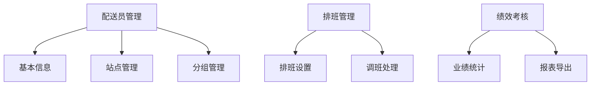
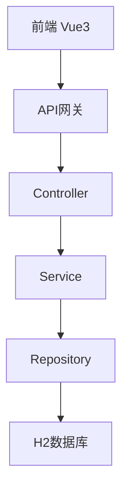

---

## 0. 执行摘要

### 问题陈述
外卖平台需要管理配送员（骑手）信息、排班安排和绩效考核，当前缺乏系统化管理，依赖人工操作，效率低下且容易出错。

### Proposed Solution
建设外卖人员管理系统，实现配送员的数字化管理，包括基本信息管理、排班调度和绩效考核三大核心功能，提升运营效率。

### 关键假设 (Hypothesis)
We believe that by implementing a staff management system, delivery operations efficiency will improve by 30%.
We'll know we're right when: 配送员信息查询响应时间 < 200ms, 排班调度效率提升 30%+

### 成功指标
| 指标 | 目标 | 衡量方式 |
|------|------|----------|
| 配送员信息管理 | 完整记录 CRUD | 系统功能验证 |
| 排班调度 | 灵活排班/调班 | 实际排班场景测试 |
| 绩效考核 | 数据化考核 | 考核报表导出 |

---

## 1. 业务背景

### 1.1 行业背景
外卖配送行业是即时配送领域的重要组成部分，配送员是平台运力的核心保障。

### 1.2 行业挑战
- 配送员流动率高，管理难度大
- 排班调度依赖人工，效率低
- 绩效考核缺乏数据支撑

### 1.3 产品目标
- 实现配送员信息电子化管理
- 提升排班调度效率
- 建立数据化绩效考核体系

### 1.4 成功指标
| 指标 | 目标值 | 衡量方式 |
|------|--------|----------|
| 系统使用率 | 100% | 配送员均在线管理 |
| 排班效率 | 提升30% | 对比人工排班时间 |
| 查询响应时间 | <200ms | API响应时间 |

---

## 2. 产品概述

### 2.1 产品定位
面向外卖平台运营方的配送员综合管理系统

### 2.2 目标用户
| 用户角色 | 描述 | 使用场景 |
|----------|------|----------|
| 运营管理员 | 平台运营人员 | 全面管理 |
| 配送站长 | 站点负责人员 | 排班、考核 |
| 配送员 | 骑手 | 查看排班、业绩 |

### 2.3 产品范围
- **包含**：配送员信息管理、排班管理、绩效考核
- **不包含**：配送调度算法、薪酬计算系统

### 2.4 竞品分析
参考美团、饿了么等平台的人员管理系统

---

## 3. 市场研究

### 3.1 竞品分析
| 竞品/方案 | 核心能力 | 优劣势 | 可借鉴点 |
|----------|---------|--------|----------|
| 美团配送 | 智能调度、骑手管理 | 功能完善 | 移动端优先 |
| 饿了么蜂鸟 | 团队管理、考勤 | 考勤一体化 | 数据化考核 |

### 3.2 行业最佳实践
- 移动端优先：配送员使用移动端操作
- 数据驱动：基于数据的绩效考核
- 实时调度：动态调整配送区域

### 3.3 技术方案参考
- Spring Boot + Vue3 主流技术栈
- H2 内存数据库适合 MVP 阶段

---

## 4. 产品设计

### 4.1 界面架构
- 首页仪表盘
- 配送员管理列表/详情
- 排班日历
- 绩效考核报表

### 4.2 核心页面设计
| 页面 | 功能 | 关键组件 |
|------|------|----------|
| 配送员列表 | 展示所有配送员 | 表格、分页、搜索 |
| 配送员详情 | 查看/编辑信息 | 表单、头像 |
| 排班日历 | 月度排班 | 日历组件、拖拽 |
| 绩效考核 | 业绩数据 | 图表、导出 |

### 4.3 交互流程
```
新增配送员 → 填写基本信息 → 分配站点 → 设置排班 → 开始工作 → 绩效考核
```

### 4.4 设计规范
- Vue3 + Naive UI 组件库
- 蓝色主色调，专业稳重

---

## 5. 用户故事

### 5.1 用户角色
| 角色 | 描述 | 权限范围 |
|------|------|----------|
| 管理员 | 平台运营 | 全部权限 |
| 站长 | 站点管理 | 本站点管理 |
| 配送员 | 骑手 | 查看本人信息 |

### 5.2 用户故事矩阵 (MoSCoW)
| ID | 角色 | 故事 | 验收标准 | 优先级 |
|----|------|------|----------|--------|
| US-001 | 管理员 | 新增配送员 | 填写信息并保存成功 | Must |
| US-002 | 管理员 | 查看配送员列表 | 显示所有配送员，分页 | Must |
| US-003 | 管理员 | 编辑配送员信息 | 修改并保存 | Must |
| US-004 | 管理员 | 删除配送员 | 逻辑删除，状态更新 | Must |
| US-005 | 管理员 | 创建排班 | 选择配送员+日期+班次 | Must |
| US-006 | 管理员 | 查看绩效考核 | 显示配送员业绩数据 | Should |
| US-007 | 配送员 | 查看我的排班 | 查看个人排班信息 | Should |
| US-008 | 配送员 | 查看我的业绩 | 查看个人考核数据 | Could |

### 5.3 业务流程图


### 5.4 异常场景
| 场景 | 处理方式 |
|------|----------|
| 重名配送员 | 提示并允许重复，需手机号唯一 |
| 排班冲突 | 提示冲突日期 |
| 删除配送员 | 逻辑删除，保留历史数据 |

---

## 6. 功能规划

### 6.1 功能架构图


### 6.2 功能列表
| 模块 | 功能点 | 功能描述 | 优先级 | 权限要求 |
|------|------------|----------------------------------|--------|----------|
| 配送员管理 | 新增配送员 | 添加配送员基本信息 | P1 | 管理员 |
| | 查看列表 | 分页展示所有配送员 | P1 | 管理员/站长 |
| | 编辑信息 | 修改配送员信息 | P1 | 管理员 |
| | 删除配送员 | 逻辑删除 | P1 | 管理员 |
| | 详情查看 | 查看完整信息 | P1 | 管理员 |
| 排班管理 | 创建排班 | 设置配送员班次 | P1 | 管理员/站长 |
| | 查看排班 | 月度排班视图 | P1 | 全部 |
| | 调班 | 修改已排班次 | P2 | 管理员/站长 |
| 绩效考核 | 业绩统计 | 配送单量、准时率 | P2 | 管理员 |
| | 数据导出 | 导出考核报表 | P2 | 管理员 |

### 6.3 版本规划
| 版本 | 范围 | 交付时间 |
|------|------|----------|
| MVP | 配送员CRUD + 基础排班 | 第1周 |
| V1.1 | 完整排班 + 绩效 | 第2周 |

---

## 7. 技术方案

### 7.1 系统架构图


### 7.2 技术栈
| 层级 | 技术 | 版本 |
|------|------|------|
| 后端 | Spring Boot | 3.5.x |
| 数据库 | H2 | 2.x |
| 前端 | Vue3 + Naive UI | 3.x |
| 构建 | Maven / Vite | 最新 |

### 7.3 数据模型
| 实体 | 表名 | 主要字段 |
|------|------|----------|
| 配送员 | delivery_staff | id, name, phone, station_id, status, created_at |
| 站点 | station | id, name, address |
| 排班 | schedule | id, staff_id, date, shift_type |
| 绩效 | performance | id, staff_id, month, order_count, on_time_rate |

### 7.4 接口设计
| 接口 | 方法 | 路径 | 说明 |
|------|------|------|------|
| 配送员列表 | GET | /api/v1/staffs | 分页获取 |
| 配送员详情 | GET | /api/v1/staffs/{id} | 获取详情 |
| 新增配送员 | POST | /api/v1/staffs | 创建 |
| 编辑配送员 | PUT | /api/v1/staffs/{id} | 更新 |
| 删除配送员 | DELETE | /api/v1/staffs/{id} | 删除 |
| 排班列表 | GET | /api/v1/schedules | 获取排班 |
| 创建排班 | POST | /api/v1/schedules | 创建排班 |
| 绩效数据 | GET | /api/v1/performances | 获取绩效 |

---

## 8. 非功能需求

### 8.1 性能要求
| 指标 | 要求 | 行业标准 |
| -------- | ------ | -------- |
| 响应时间 | <200ms | <100ms |

### 8.2 可用性
| 指标 | 要求 |
| ------ | ------ |
| 可用性 | >99.9% |

### 8.3 安全
| 要求 | 说明 |
| ------ | ---- |
| 鉴权 | 需要登录 |
| 数据安全 | 本地存储 |

### 8.4 合规要求
| 法规 | 要求 |
| ---- | ---- |
| 数据隐私 | 保护个人信息 |

---

## 9. 风险评估

### 9.1 技术风险
| 风险 | 影响 | 应对措施 |
|------|------|----------|
| H2 并发 | 有限制 | 后续迁移 MySQL |

### 9.2 业务风险
| 风险 | 影响 | 应对措施 |
|------|------|----------|
| 需求变更 | 影响进度 | 敏捷迭代 |

### 9.3 依赖项
| 依赖方 | 内容 | 时间 |
|--------|------|------|
| Naive UI | 前端组件库 | 即时 |

---

## 10. 决策日志

| 决策 | 选择 | 替代方案 | 理由 |
|------|------|----------|------|
| 数据库 | H2 | MySQL/PostgreSQL | MVP阶段快速开发 |
| 前端框架 | Vue3 | React | 团队熟悉度 |
| 组件库 | Naive UI | Element Plus | Vue3 原生支持 |

---

## 11. 附录

### 11.1 术语表
| 术语 | 说明 |
|------|------|
| 配送员 | 外卖骑手，负责配送 |
| 站点 | 配送员所属配送站点 |
| 班次 | 配送员工作时间班次 |
| 绩效 | 配送员工作考核数据 |

### 11.2 参考文档
| 文档 | 链接 |
|------|------|
| Spring Boot | https://spring.io/projects/spring-boot |
| Vue3 | https://vuejs.org/ |
| Naive UI | https://www.naiveui.com/ |

---

**文档状态**: DRAFT
**创建时间**: 2026-04-26
**下一步**: 执行架构设计和代码生成