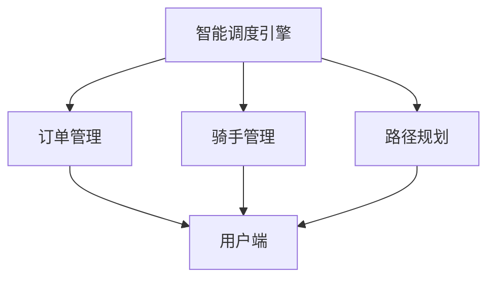
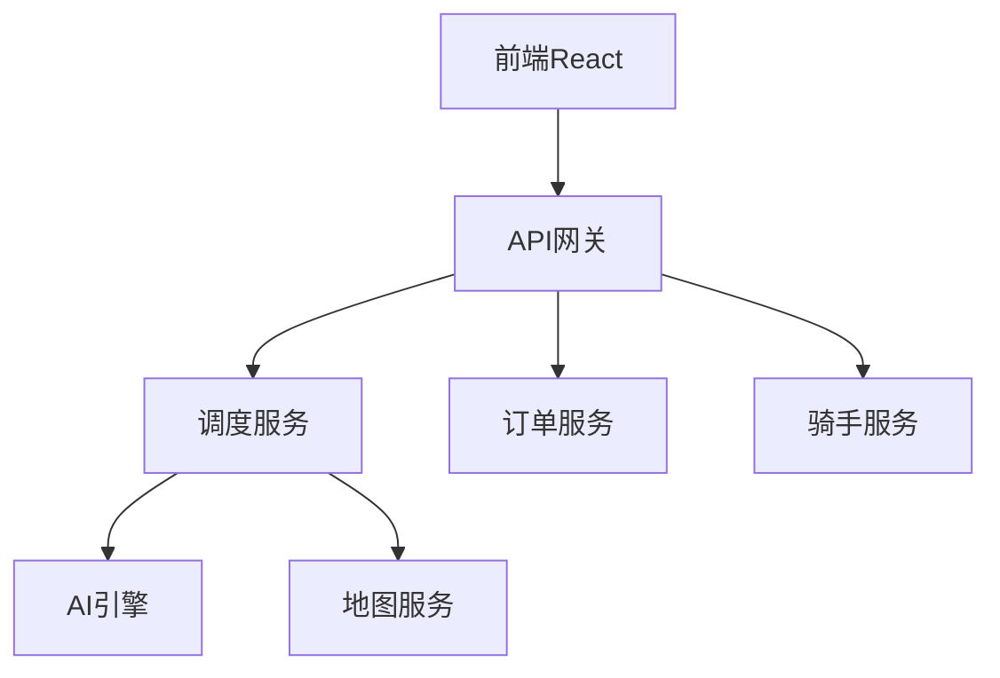

# PRD：智能配送调度系统

> 基于物流配送领域知识生成

---

## 0. 执行摘要

### 问题陈述
当前物流配送主要依赖人工调度，效率低、成本高、用户体验差。配送路线规划不合理导致骑手空驶率高，用户无法感知配送进度。

### Proposed Solution
构建智能配送调度系统，AI 算法自动规划最优路线，实时轨迹追踪，提升配送效率 30%，降低运营成本。

### 关键假设 (Hypothesis)
我们相信通过AI智能调度算法，能够让配送效率提升30%以上。
我们将通过A/B测试和行业基准对比来验证。

### 成功指标

| 指标 | 目标 | 衡量方式 |
|------|------|----------|
| 配送效率提升 | ≥30% | 路线优化前后对比 |
| 妥投率 | ≥98% | 成功派送/总订单 |
| 用户满意度 | ≥4.5分 | 5分制评价 |

---

## 1. 业务背景

### 1.1 行业背景
中国物流市场规模超过12万亿元，即时配送是增长最快的细分领域。（*引用自知识库*）

### 1.2 行业挑战
- 城市配送"最后一公里"成本高企
- 淡旺季运力不均衡，资源利用率低
- 用户对时效预期越来越高
- 末端协同：快递员与用户沟通难

### 1.3 产品目标
- AI 自动规划配送路线，减少空驶
- 实时轨迹，用户可感知配送进度
- 智能调度算法，提升整体效率

### 1.4 成功指标
| 指标 | 目标值 | 衡量方式 |
|------|--------|----------|
| 配送效率提升 | ≥30% | 对比基准 |
| 妥投率 | ≥98% | 成功/总订单 |

---

## 2. 产品概述

### 2.1 产品定位
智能配送调度系统，为物流配送公司提供AI驱动的调度解决方案。

### 2.2 目标用户

| 用户角色 | 描述 | 使用场景 |
|----------|------|----------|
| 配送骑手 | 执行配送任务 | 接单、配送、完成 |
| 调度管理员 | 监控系统、调整策略 | 查看数据、配置规则 |
| C端用户 | 发起配送需求 | 下单、查看进度、签收 |

### 2.3 产品范围
- **包含**：智能调度、实时追踪、订单管理、骑手管理
- **不包含**：财务结算、客服系统

### 2.4 竞品分析

| 竞品 | 优势 | 劣势 | 差异化 |
|------|------|------|--------|
| 美团配送 | AI算法强、生态完善 | 抽佣高 | 算法开放 |
| 饿了么蜂鸟 | 阿里生态 | 依赖阿里 | 独立运营 |
| 顺丰同城 | 品质高 | 价格高 | 高端市场 |

---

## 3. 市场研究

### 3.1 竞品分析

| 竞品/方案 | 核心能力 | 优劣势 | 可借鉴点 |
|----------|---------|--------|----------|
| 美团调度 |路径规划、实时调整 | 算法强 | 动态调整机制 |
| 饿了么蜂鸟 | 骑手画像、匹配 | 数据丰富 | 骑手画像 |

### 3.2 行业最佳实践

- 动态调度：基于实时路况调整路线
- 区域派单：固定区域负责制
- 智能匹配：AI 推荐最优骑手

### 3.3 技术方案参考

| 方案 | 技术特点 | 适用性 |
|------|----------|--------|
| Flink实时计算 | 低延迟 | 实时调度 |
| 高德/腾讯地图 | 国内覆盖全 | 路径规划 |

---

## 4. 产品设计

### 4.1 界面架构
- 首页仪表盘
- 订单管理
- 骑手管理
- 调度中心
- 数据分析

### 4.2 核心页面设计

| 页面 | 功能 | 关键组件 |
|------|------|----------|
| 调度中心 | 实时调度监控 | 地图、任务列表 |
| 订单管理 | 订单列表、详情 | 筛选、详情 |
| 骑手管理 | 骑手列表、状态 | 状态切换、轨迹 |

### 4.3 交互流程
用户下单 → 进入调度池 → AI计算最优 → 分配骑手 → 骑手取货 �� 配送中 → 完成

### 4.4 设计规范
- 地图组件使用高德/腾讯地图SDK
- 列表采用虚拟滚动支撑大数据

---

## 5. 用户故事

### 5.1 用户角色

| 角色 | 描述 | 权限范围 |
|------|------|----------|
| ADMIN | 管理员 | 全部权限 |
| RIDER | 骑手 | 接单、完成 |
| USER | 普通用户 | 下单、查看 |

### 5.2 用户故事矩阵 (MoSCoW + INVEST)

| ID | 角色 | 故事 | 验收标准 | 优先级 | INVEST |
|----|------|------|----------|--------|--------|
| US-001 | RIDER | 收到调度推送 | Given有新订单, When骑手查看, Then显示订单详情和最优路线 | Must | ✅ |
| US-002 | RIDER | 一键接单 | Given 有待接订单, When 点击接单, Then 订单状态变为"已接单" | Must | ✅ |
| US-003 | USER | 查看配送进度 | Given 已下单, When 进入订单详情, Then 显示实时位置和预计到达时间 | Must | ✅ |
| US-004 | ADMIN | 调整调度策略 | Given 进入调度配置, When 修改参数, Then 新订单按新策略执行 | Should | ✅ |

#### 验收标准示例

| 故事 | 验收标准 |
|------|----------|
| US-001 | AC-1: Given 有新订单, When 骑手收到推送, Then 显示订单详情含最优路线 |
| US-002 | AC-1: Given 有待接订单, When 骑手点击接单, Then 订单状态变为"已接单"并通知用户 |

### 5.3 业务流程图

### 5.4 异常场景

| 场景 | 处理方式 |
|------|----------|
| 骑手拒单 | 自动推给下一个骑手 |
| 用户拒收 | 进入异常处理流程 |
| 超时未配送 | 触发升级告警 |

### 5.5 需求追溯矩阵

> 将在 test-design 阶段填充测试用例

---

## 6. 功能规划

### 6.1 功能架构图

### 6.2 功能列表

| 模块 | 功能点 | 功能描述 | 优先级 |
| ---- | ------ | -------- | ------ |
| 调度 | 智能派单 | AI自动分配订单 | P0 |
| 调度 | 路径规划 | 最优路线计算 | P0 |
| 订单 | 创建订单 | 用户下单 | P0 |
| 订单 | 进度追踪 | 实时轨迹 | P0 |
| 骑手 | 状态管理 | 骑手在线状态 | P1 |
| 数据 | 统计报表 | 效率分析 | P2 |

### 6.3 版本规划

| 版本 | 范围 | 交付时间 |
| ---- | ------ | -------- |
| MVP | 智能派单 + 路径规划 + 基础订单 | v1.0 |
| v1.1 | 实时轨迹 + 骑手管理 | - |
| v1.2 | 数据分析报表 | - |

---

## 7. 技术方案

### 7.1 系统架构图

### 7.2 技术栈

| 层级 | 技术 | 版本 |
| ---- | ---- | ---- |
| 后端 | Spring Boot | 3.5.x |
| 调度 | 自研 + AI | - |
| 地图 | 高德SDK | - |
| 前端 | React + Ant Design | 18.x |

### 7.3 数据模型

| 实体 | 字段 | 类型 | 说明 |
| ---- | ---- | ---- | ---- |
| Order | order_id | String | 主键 |
| Order | status | Enum | PENDING/ACCEPTED/COMPLETED |
| Order | rider_id | String | 接单骑手 |
| Rider | rider_id | String | 主键 |
| Rider | status | Enum | ONLINE/DELIVERING/OFFLINE |

### 7.4 接口设计

| 接口 | 方法 | 路径 | 说明 |
| ---- | ---- | ---- | ---- |
| 创建订单 | POST | /api/v1/orders | 创建配送任务 |
| 查询订单 | GET | /api/v1/orders/{id} | 获取订单详情 |
| 骑手接单 | POST | /api/v1/orders/{id}/accept | 接单 |
| 完成配送 | POST | /api/v1/orders/{id}/complete | 确认送达 |

---

## 8. 非功能需求

### 8.1 ��能要求

| 指标 | 要求 |
|------|------|
| 调度响应时间 | <3s |
| 订单响应时间 | <500ms |
| 地图加载时间 | <1s |

### 8.2 可用性

| 指标 | 要求 |
|------|------|
| 可用性 | ≥99.9% |
| 故障恢复时间 | <30min |

### 8.3 安全

| 要求 | 说明 |
|------|------|
| 鉴权 | 需要JWT Token |
| 数据安全 | 敏感字段加密存储 |

### 8.4 合规要求

| 法规 | 要求 |
|------|------|
| 快递暂行条例 | 实名制 |
| 个人信息保护法 | 用户授权 |

---

## 9. 风险评估

### 9.1 技术风险

| 风险 | 影响 | 应对措施 |
|------|------|----------|
| AI调度不准 | 效率下降 | 人工兜底 + 持续迭代 |
| 地图定位失败 | 无法规划 | 备用地图服务商 |

### 9.2 业务风险

| 风险 | 影响 | 应对措施 |
|------|------|----------|
| 骑手不配合 | 无法落地 | 激励机制 |

---

## 10. 决策日志

| 决策 | 选择 | 理由 |
|------|------|------|
| 调度引擎 | 自研 | 差异化竞争 |
| 地图服务商 | 高德 | 国内覆盖全 |

---

## 11. 附录

### 11.1 术语表

| 术语 | 说明 |
|------|------|
| 妥投 | 收件人签收 |
| 妥投率 | 成功派送比例 |
| 弃货 | 无法派送被退回 |

### 11.2 参考文档
- 行业报告：艾瑞咨询物流报告
- 技术文档：高德开放平台

---

**文档状态**: DRAFT
**创建时间**: 2026-05-08
**基于知识**: knowledge-logistics-20260508